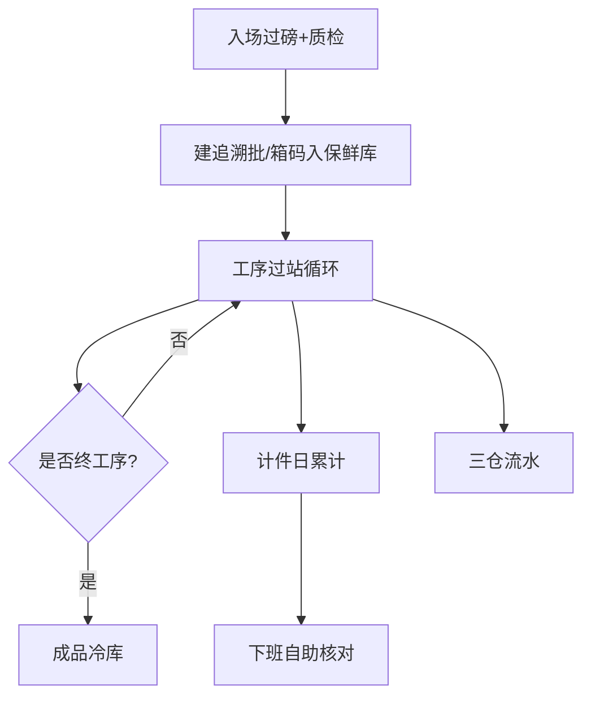

# 木薯粗加工 · 生产最终优化方案（重构理论依据）

| 项目 | 说明 |
|------|------|
| 文档版本 | v1.0 |
| 状态 | 重构前理论定稿（非实现说明） |
| 对照基线 | 当前 `派工 → 报工 → 确认 → AfterReportWork` |
| 关联文档 | [木薯粗加工需求澄清与现状差距分析.md](./木薯粗加工需求澄清与现状差距分析.md) |
| 交互 Demo | [demos/cassava-station-flow-demo.html](./demos/cassava-station-flow-demo.html) |

---

## 1. 优化目标

把生产主线从「单据驱动（任务/工单/派工/报工）」升级为：

> **箱码（追溯批）驱动的工序过站**：现场一次过站动作同时完成投料/完工/损耗/库存/计件。

派工降级为**班次授权与例外管理**工具，不再作为每箱必经凭证。

### 1.1 成功标准

| 指标 | 目标 |
|------|------|
| 现场主路径单据数 | 每箱每工序仅 1 次「过站确认」 |
| 计件口径 | 唯一：确认过站的完工重 × 工价 |
| 库存驱动 | 仅过站确认触发出入库与损耗扣账 |
| 200–400 人体验 | 扫工牌+扫箱+过磅 ≤ 3 步；下班可自助核对 |
| 派工使用率 | 正常流转 0 张；仅返工/顶岗/月薪岗留派岗 |

---

## 2. 现状问题（重构动机）

```
任务 → 工单 → 派工 → 扫码报工(草稿) → 确认 → 流程引擎
         ↑ 常自动 spawn，现场感知弱
```

| 问题 | 影响 |
|------|------|
| 派工多为账面自动生成 | 工人不知「接派工」，单据噪音大 |
| 报工双路径（扫码确认 / 简易 create） | 损耗、计件、库存口径漂移 |
| 管理对象是派工单而非箱码事件 | 难做利用率异常、班次看板 |
| BOM/MRP 与现场脱节 | 现场靠重量差，计划靠占位 BOM |

**结论**：模式「派工+报工」起步合理，但对木薯重量型产线应演进为 **MES 过站**，而非继续加厚派工状态机。

---

## 3. 目标架构

### 3.1 概念模型

| 概念 | 定义 | 替代现状 |
|------|------|----------|
| 追溯批 TraceLot | 收货日+农户+产地+净重 | 扩展箱码/批次 |
| 箱码 Box | 在制载体，挂当前工序与仓 | `inv_box_code` |
| 班次 Shift | 日期+车间+工序授权人员范围 | 弱化 `pd_dispatch` |
| 过站 StationPass | 箱在工序的一次确认事件 | 统一 `pd_report_work` 语义 |
| 派岗 Assignment | 可选：返工/顶岗/月薪责任 | 仅例外使用 `pd_dispatch` |

### 3.2 主流程（目标）



单次过站原子动作：

```
扫工牌 → 扫箱码 → 录/称 投料重、完工重 → QC → 确认
  ⇒ loss = max(input-output,0)
  ⇒ util = output/input
  ⇒ 出库(投料) / 入库或转下工序(完工) / 废料(损耗)
  ⇒ 计件累加(若工序计件)
  ⇒ 箱码 current_process 前移
```

### 3.3 与现状映射（重构不推倒重来）

| 目标对象 | 复用/改造 |
|----------|-----------|
| StationPass | 收敛为唯一写入路径的 `pd_report_work`（status: pending→posted） |
| 班次授权 | 新建轻量 `pd_shift` / 或复用派工「按工序+人员范围」 |
| TraceLot | `inv_box_code` + 农户/产地/收货日字段 |
| AfterReportWork | 保留为过站后副作用引擎，入参统一 |
| 简易 report-works create | **下线或仅管理员补单** |
| 每箱自动派工 | **停止 spawn**；有班次授权即可过站 |

---

## 4. 统一计算公式（全工序通用）

| 符号 | 含义 |
|------|------|
| \(I\) | 投料重 input_weight |
| \(O\) | 完工重 output_weight |
| \(L\) | 损耗 loss |
| \(U\) | 利用率 utilization |
| \(R\) | 工价 rate（元/斤或元/kg，与配置一致） |

```
L = max(I - O, 0)
U = O / I          （I > 0；允许 U > 1 并告警）
计件金额 = O × R   （仅 is_piecework=1）
任务完工累加 += O
出库数量 = I（或工序配置的消耗口径）
入库/转序数量 = O
```

入场专用：

```
净重 = 毛重 × (1 - 扣损率)  或  毛重 - 扣损重
合格 → 入保鲜库；不合格 → 留档不入库
农户应付依据 = 扣损后净重
```

**禁止**：计件用 \(O-L\)、简易报工跳过损耗、未确认即过账。

---

## 5. 每一道工序运转流程（定稿）

下列顺序对齐当前木薯丁产线种子（`RT-CASSAVA`），并按需求文案对齐「清洗→去皮→切断→去芯→切块→过筛装袋」。仓站与卡点单独成站。

### 总览

| 序号 | 工位 | 类型 | 计件 | 主要工具/设备 | 仓动作 |
|------|------|------|------|----------------|--------|
| 0 | 入场过磅+质检 | 收货 | 否 | 外磅单/叉车秤、快检 | 合格→保鲜库 |
| 1 | 入库-原料（保鲜库） | 仓站 | 否 | 叉车、托盘、箱码打印 | 入 WH-RAW |
| 2 | 清洗 | 加工 | 否* | 清洗池/滚筒清洗线 | 在制，可记损耗 |
| 3 | 去皮 | 加工 | **是** | 去皮刀/去皮机 | 消耗原料侧重量 |
| 4 | 收货卡点（1） | 卡点 | 否 | 台秤、质检台 | 核对过站，不强制出入库 |
| 5 | 切断 | 加工 | 否（月薪） | 切断机 | 在制过站 |
| 6 | 去芯 | 加工 | **是** | 去芯台/刀具 | 在制过站 |
| 7 | 收货卡点（2） | 卡点 | 否 | 台秤 | 半成品前复核 |
| 8 | 入库-半成品库 | 仓站 | 否 | 叉车 | 入 WH-SEMI |
| 9 | 出库切块 | 加工 | **是** | 切丁机、半成品出库 | 出 SEMI + 在制 |
| 10 | 入库-半成品库（缓冲） | 仓站 | 否 | 叉车 | 可配置跳过 |
| 11 | 过筛装袋 | 加工 | 否* | 筛网、装袋台 | 在制→待成品 |
| 12 | 入库-成品冷库 | 仓站 | 否 | 冷库叉车 | 入 WH-FG |

\* 清洗/装袋若现场按斤计件，配置 `is_piecework=1` 即可，公式不变。

---

### 站 0 · 入场过磅 + 质检

**目的**：建追溯批，驱动农户结算与保鲜库入库。

| 项 | 内容 |
|----|------|
| 角色 | 过磅员、质检员 |
| 输入 | 农户、产地、渠道（外磅/厂内）、毛重、扣损、影像 |
| 输出 | TraceLot + 箱码；合格入库指令 |
| 工具 | 地磅/叉车秤、手机拍照、快检器具 |
| 不做 | 不建派工、不计件 |

**运转步骤**：选农户 → 录/拍过磅单 → 算净重 → 质检 → 合格打印箱码入保鲜库 / 不合格留档。

---

### 站 1 · 入库-原料（保鲜库）

| 项 | 内容 |
|----|------|
| 角色 | 仓管 |
| 过站动作 | 扫箱确认入库（或入场合格自动过站） |
| 库存 | `auto_stock_in` → WH-RAW |
| 下一站 | 清洗 |

---

### 站 2 · 清洗

| 项 | 内容 |
|----|------|
| 角色 | 清洗班（可班次授权，非逐箱派工） |
| 工具 | 清洗池 / 滚筒线、沥水架、台秤 |
| 过站 | 投料=出保鲜或上站完工；完工=洗净重；记泥沙/杂质损耗 |
| 计件 | 默认否；可配置 |
| 库存 | 通常仅转序，不换仓；损耗走废料 |

---

### 站 3 · 去皮（计件）

| 项 | 内容 |
|----|------|
| 角色 | 临时工（计件） |
| 工具 | 去皮刀/去皮机、料筐、台秤 |
| 过站 | 工牌+箱码+投料/完工 → 确认 |
| 工资 | \(O \times R_{peel}\) |
| 库存 | 可 `auto_stock_out` 扣原料侧；箱码转下工序 |
| 注意 | 皮渣记入 \(L\) 与废料类型 `peel_scrap` |

---

### 站 4 · 收货卡点（去皮后）

| 项 | 内容 |
|----|------|
| 角色 | 固定工 / 班组长 |
| 工具 | 台秤、记录板/平板 |
| 过站 | 复核重量与外观；`is_inbound_checkpoint` |
| 计件 | 否 |
| 作用 | 防止计件虚报；不通过则退回去皮或待处理 |

---

### 站 5 · 切断（固定月薪）

| 项 | 内容 |
|----|------|
| 角色 | 固定工 |
| 工具 | 切断机、输送带、防护装置 |
| 过站 | 仍扫码记投料/完工/损耗（设备节拍可后续挂 OEE） |
| 计件 | **否**（只留产量与利用率） |
| 派岗 | 可选：当日机台责任人派岗 |

---

### 站 6 · 去芯（计件）

| 项 | 内容 |
|----|------|
| 角色 | 临时工 |
| 工具 | 去芯台、刀具、分料筐 |
| 过站 | 同去皮；芯料进废料或副产物类型 |
| 工资 | \(O \times R_{core}\) |

---

### 站 7 · 收货卡点（去芯后）

同站 4，作为半成品入库前质量闸门。

---

### 站 8 · 入库-半成品库

| 项 | 内容 |
|----|------|
| 角色 | 仓管 |
| 库存 | 入 WH-SEMI；箱状态 semi |
| 外购半成品 | 从此仓入，来源标记 `external`，与自产分账 |

---

### 站 9 · 出库切块（计件）

| 项 | 内容 |
|----|------|
| 角色 | 临时工 |
| 工具 | 切丁机、半成品出库复核秤 |
| 过站 | 出 SEMI（投料）+ 完工重计件 + 转在制/待装袋 |
| 工资 | \(O \times R_{dice}\) |

---

### 站 10 · 入库-半成品库（缓冲，可配置）

切块与装袋之间若需暂存则保留；若连续作业可在工艺图中 `skip` 或合并。

---

### 站 11 · 过筛装袋

| 项 | 内容 |
|----|------|
| 角色 | 包装班 |
| 工具 | 筛网、装袋台、封口、袋标/箱码 |
| 过站 | 投料=筛前；完工=袋装净重；袋数 `bag_qty` |
| 计件 | 可按袋或按斤配置 |

---

### 站 12 · 入库-成品冷库

| 项 | 内容 |
|----|------|
| 角色 | 仓管 |
| 库存 | 入 WH-FG；箱 `finished` |
| 下一动作 | 销售出库（非本方案 P0 展开） |

---

## 6. 角色 × 系统动作矩阵

| 角色 | 日常动作 | 系统对象 |
|------|----------|----------|
| 过磅/质检 | 入场建批 | WeighTicket / TraceLot |
| 仓管 | 三仓确认、盘点 | StationPass(仓站) |
| 计件工 | 过站确认、下班核对 | StationPass + 日结 |
| 固定工 | 切断/卡点过站 | StationPass（不计件） |
| 班组长 | 开班次、异常放行、派岗 | Shift / Assignment |
| 车间主管 | 利用率看板、返工指令 | 看板 + 例外派岗 |
| 结算 | 农户净重应付、计件日结 | 结算单 / 工资汇总 |

---

## 7. 异常与例外

| 场景 | 处理 |
|------|------|
| \(U>1\) 或 \(U\) 低于阈值 | 过站可完成但进班组长异常队列 |
| QC fail | 不过账；箱码挂待处理 |
| 返工 | 班组长派岗到指定工序；过站后回到主链 |
| 顶岗 | 班次授权临时加人，无需每箱派工 |
| 补单 | 仅主管角色；强制填原因与影像 |
| 已过账纠错 | 冲销过站 + 新过站（禁止改历史Posted静默改数） |

---

## 8. 重构分期建议

### P0（对齐现场闭环）

1. 唯一过站 API（合并 scan+confirm 语义，保留确认闸）
2. 停止每箱自动派工；增加班次/工序授权
3. 下线简易报工计件旁路
4. 统一 \(L/U\) 与计件口径
5. 员工端「今日产量/工资核对」

### P1（收货与溯源）

1. 过磅单 + 双渠道 + 影像  
2. 农户/产地挂 TraceLot  
3. 不合格留档不入库  

### P2（管理升级）

1. 利用率/损耗班次看板  
2. 切断工位简易 OEE（可选）  
3. 外购半成品分账强化  

---

## 9. 非目标（防止范围膨胀）

- 不上完整 APS/精细到机台分钟排程（P0/P1）
- 不把离散制造齐套发料当主模型
- 不把 `sys_formula` 做成通用表达式引擎（生产公式固定为重量模型）
- 不在本阶段重做总账，只保证结算依据

---

## 10. Demo 与评审用法

1. 打开 [cassava-station-flow-demo.html](./demos/cassava-station-flow-demo.html)  
2. 按左侧工位逐步演示「目标过站」与库存/计件副作用  
3. 对照「现状 vs 目标」页与研发评审重构边界  
4. 评审通过后，再拆 API/表结构改造任务（另开实现 PR）

---

## 11. 评审检查清单

- [ ] 是否同意「过站主线、派工例外」？
- [ ] 12+1 工位清单是否与现场实际一致（尤其站 10 缓冲是否保留）？
- [ ] 计件工序集合是否确认（去皮/去芯/切块，及其他）？
- [ ] 确认闸（工人确认后过账）是否保留？
- [ ] 利用率异常是否允许过站后告警，还是阻断？

---

## 12. 端侧职责与 App 精简

### 12.1 职责矩阵

| 端 | 定位 | 禁止 |
|---|---|---|
| **Flutter App** | 现场唯一业务输入：扫、称、确认 | 主数据维护、复杂派工编排 |
| **Admin Web** | 配置、查询、结算、异常补单 | 日常扫码报工、手工填产量 |

### 12.2 App 模块（木薯试点 P0）

| 模块 | 工位 | 路由 | 角色 |
|---|---|---|---|
| 过磅收货 | 站 0 | `/receiving` | 过磅员、质检 |
| 工序过站 | 站 2–7, 9, 11 | `/station` | 计件工、固定工、卡点 |
| 仓管作业 | 站 1, 8, 10, 12 | `/warehouse` | 仓管 |
| 班组管理 | 例外 | `/workshop` | 班组长 |
| 我的 | — | `/mine` | 全员（含今日核对） |

**移出默认 App**：销售外勤、固定资产、收款协同（路由保留供演示）；资料中心并入「我的」。

**默认壳**：按角色底部 Tab（2–4 项），不再以通用工单 FAB 为主入口。

### 12.3 Admin 只读 / 可写清单

| 模块 | Admin | App |
|---|---|---|
| 过站记录 | 只读列表 + 管理员补单 | **唯一日常写入** |
| 例外派岗 | 例外派岗 + 查询 | 产线班次授权即可过站 |
| 产线班次 | 开工/收工/成员授权 | App 只读（班组长查看） |
| 农户过磅 | 审核 / 补单 | **主路径录入** |
| 仓管入库 | 流水查询 | **现场确认** |
| 工序 / 工艺 / 工价 | 配置 | — |
| 加工记录 / 计件汇总 | 查询 | 我的 · 今日核对 |

### 12.4 API 写入策略

- `POST /production/scan`、`POST .../confirm`：现场角色（mobile client）
- `POST /production/report-works`：仅 `sys_admin` 且带 `backfill_reason`
- 确认过账后：`AfterReportWork` 驱动库存 / 计件；正常流转**不**每箱 spawn 派工

---

## 13. 可交付标准与 Loop 门禁

对齐 [ADMIN_DELIVERY.md](./ADMIN_DELIVERY.md)、[mobile/DELIVERY.md](../mobile/DELIVERY.md)、[GATE_SIGN_OFF.md](./GATE_SIGN_OFF.md)。

### 13.1 业务 DoD

| # | 标准 | 验证 |
|---|---|---|
| B1 | 过磅→过站→三仓→计件闭环 | `station_pass_smoke` |
| B2 | 现场零 Admin 日常录入 | 角色 smoke + 走查 |
| B3 | Admin 报工/派工无默认创建表单 | UI + API 403 |
| B4 | 口径唯一 L/U/计件 | biz 单测 + smoke |
| B5 | 计件工 App ≤4 模块 | 模块可见性 |
| B6 | 下班核对在「我的」首屏 | mobile smoke |
| B7 | QC fail 阻断 | smoke |
| B8 | 无权限 403 | release_gate |
| B9 | 文档四处一致 | diff 审查 |

### 13.2 工程 DoD

```bash
go test ./internal/biz/ -count=1
powershell -File scripts/release_gate.ps1   # 或等效 health 检查
go run ./cmd/mobile_delivery_smoke          # DELIVERY_SMOKE_OK
go run ./cmd/station_pass_smoke             # STATION_PASS_SMOKE_OK
go run ./cmd/erp-tools openapi-coverage
bash scripts/delivery_loop.sh               # DELIVERY_LOOP_OK
```

### 13.3 Delivery Loop

1. 单测 → release_gate → mobile_smoke → station_pass_smoke → openapi-coverage  
2. 输出 `docs/DELIVERY_LOOP_REPORT.md`  
3. 交付前连续 2 次 `DELIVERY_LOOP_OK`  
4. 更新 `GATE_SIGN_OFF.md` 签字归档

### 13.4 角色手工走查

| 角色 | 路径 | 预期 |
|---|---|---|
| u_piece | 过站→确认→我的核对 | 无 Admin |
| u_fixed | 过站 | 无计件金额 |
| u_purchase / u_qc | 过磅收货 | 箱码 |
| u_warehouse | 待入库 | 库存变 |
| u_foreman | 班组 | 无每箱派工 |
| admin | 生产 Hub | 无报工创建表单 |
