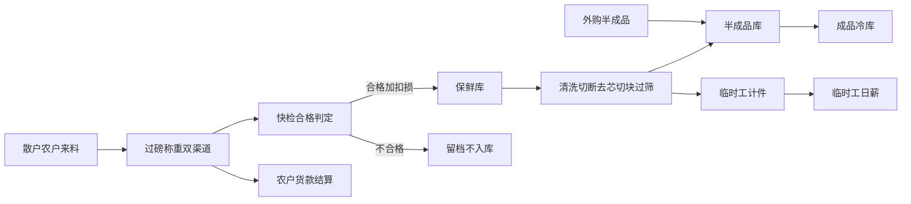
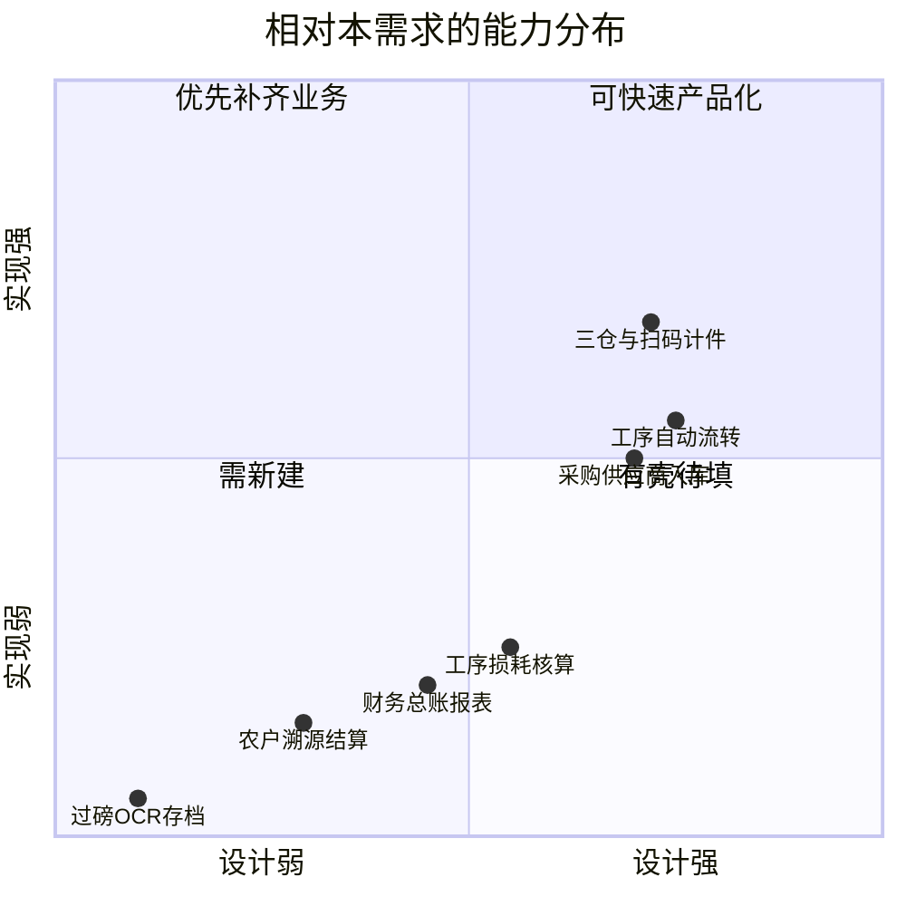
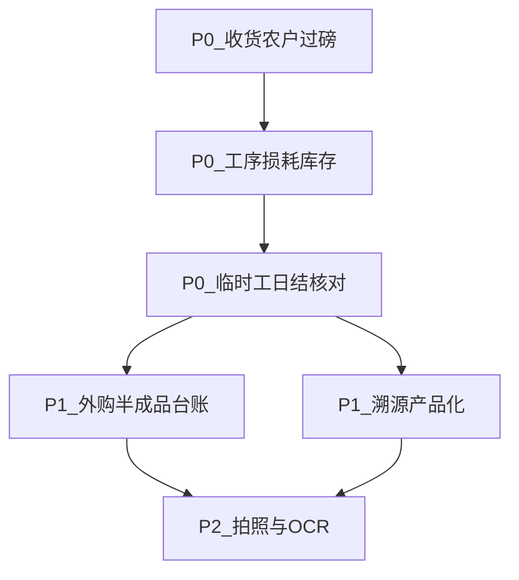

# 木薯粗加工需求澄清与现状差距分析

| 项目 | 说明 |
|------|------|
| 文档版本 | v1.0 |
| 对照需求 | 木薯粗加工数字化管理系统需求整理 |
| 对照基线 | 本仓库加工厂 ERP（OpenAPI + `erp-api` + 多端 Vue） |
| 相关文档 | [系统框架设计.md](./系统框架设计.md)、[加工厂ERP系统框架设计文档.md](../加工厂ERP系统框架设计文档.md)、[ERP-持续开发约束.md](./ERP-持续开发约束.md) |

---

## 一、需求澄清（规范化理解）

本需求描述的是**木薯粗加工厂现场作业数字化**，不是通用制造业 ERP 全集。核心是一条「散户收货 → 三仓 → 多工序损耗 → 计件/结算」闭环。

### 1.1 业务主体与对象

| 对象 | 需求含义 | 关键数据 |
|------|----------|----------|
| 农户（散户） | 原料供应方，需溯源与货款结算 | 姓名、电话、产地、专属追溯码 |
| 外部代工厂 | 半成品供应方 | 来料称重、损耗、独立台账 |
| 临时工（200–400 人） | 按重量计件 | 工种、领料/完工重量、当日累计、单价 |
| 固定月薪工 | 如切断工序 | 工序记录为主，非计件 |
| 三仓 | 保鲜库 / 半成品库 / 成品冷库 | 独立台账，流转自动改库存 |
| 追溯码 | 绑定收货日+农户+产地，跟货流转 | 全链路反向查询 |

### 1.2 六条必须闭环

1. **原料入场**：双渠道过磅（外部纸质单 / 厂内叉车秤）→ AI/拍照录入 → 毛重/扣损/净重 → 质检 → 合格入保鲜库；不合格不入库但留档；净重驱动农户结算。
2. **三仓库存**：保鲜/半成品/成品独立；工序消耗与出入库自动更新。
3. **工序损耗**：清洗→切断→去芯→切块→过筛；每步投料/完工/损耗；自动算利用率。
4. **临时工计件**：工种（剥皮/清洗/去芯/切块）按斤单价；分次领料+完工；日累计自动算薪；员工可下班核对。
5. **外购半成品**：入半成品库，与自产区分台账，可录损耗。
6. **财务联动**：农户货款（扣损后净重）+ 临时工计件汇总 → 报表（侧重点是结算依据，不是完整总账）。

### 1.3 隐含点澄清结论

按现场粗加工语境，采用如下默认理解（定稿）：

| 需求表述 | 澄清结论 |
|----------|----------|
| 专属追溯码 | **收货批次级载体**（可映射箱/批），绑定当日收货日期、农户、产地；全流程跟随货物流转。不是「每人终身一码即可完事」。 |
| 保鲜库 | 等同鲜木薯**原料仓**；系统内可用 `warehouse_type=raw`，显示名可配置为「保鲜库」。 |
| 成品冷库 | 等同**成品仓**（`finished`），显示名可配置。 |
| 木薯剥皮 | 与现有产线「去皮」同义。 |
| 工序列表未写装袋/销售 | 成品冷库暗示仍有成品入出库；装袋/销售可作为延伸，非本需求 P0。 |
| AI 识别过磅单 | **明确新能力**；可后置于人工双模板录入。 |
| 手机拍照存档 | 入场单附件能力，需挂到过磅/收货单据。 |
| 财务自动核算 | 优先指**结算依据与汇总**（农户应付、计件日结），不是完整会计凭证体系。 |

### 1.4 关键实体定稿

| 实体 | 职责 | 与现有模型关系 |
|------|------|----------------|
| 农户（Farmer） | 散户档案：姓名、联系方式、产地/场地、默认追溯码前缀 | **新建或从供应商细分**；不可简单等同「合作社供应商」 |
| 过磅单（WeighTicket） | 渠道（外磅/厂内）、毛重、扣损率、扣损后净重、影像、来源模板 | **新建**；驱动入保鲜库与农户结算 |
| 收货批/追溯码（TraceLot） | 绑定收货日+农户+产地；后续箱码/在制挂此批 | 可扩展 `inv_box_code` / 批次，需显式挂农户 |
| 质检结论 | 合格入库 / 不合格留档不入库 | 复用来料质检表意，须强绑定过磅单 |
| 三仓台账 | 保鲜、半成品、成品独立结存与流水 | 复用 `inv_warehouse` + `inv_balance` + `inv_stock_txn` |
| 工序报工 | 投料重、完工重、损耗、利用率 | 复用 `pd_report_work`，须真正写入扣损字段 |
| 计件日结 | 工种单价 × 当日累计重量 | 复用 `pay_process_wage_rate` + `pd_piecework_summary` |
| 外购半成品入库 | 来源类型=外购，入半成品库 | 复用采购入库，增加来源维度 |
| 农户结算单 | 以扣损后净重为数量依据 | **新建轻量结算单据**（非完整总账） |

---

## 二、当前项目定位（对照基线）

当前仓库是**契约先行的通用加工厂 ERP 框架**，以木薯计件产线为标杆演示场景：

| 维度 | 现状 |
|------|------|
| 域范围 | 13 大域齐全（销售/CRM/采购/生产/库存/产品/资产/财务/工资/人事/报表/审批/系统） |
| 契约 | OpenAPI 路径全覆盖；大量接口落 `erp_doc` JSON —— **路由有 ≠ 业务真落地** |
| 已较实装 | 登录/RBAC、采购供应商链、生产扫码报工+流程引擎、计件汇总、三仓种子、箱码追溯 |
| 前端 | portal / admin / boss；Flutter `mobile/`（员工现场唯一端）；客户自助仅 API、无前端 |

产线种子（[`migrations/erp/data-dev.sql`](../migrations/erp/data-dev.sql)）比需求更长：

`原料入库 → 清洗 → 去皮(计件) → 收货卡点 → 切断(固定工) → 去芯(计件) → … → 出库切块 → 半成品入库 → 过筛装袋 → 成品入库`

三仓种子：`WH-RAW` / `WH-SEMI` / `WH-FG`（类型 `raw` / `semi` / `finished`）。

---

## 三、差距对照矩阵

### 3.1 A. 高度对齐（可复用，需贴合业务文案/配置）

| 需求点 | 现状 | 差异说明 |
|--------|------|----------|
| 三仓分仓 | `inv_warehouse` 已有 raw/semi/finished 种子 | 名称是「原料仓」非「保鲜库/成品冷库」；显示名与业务规则可配置对齐 |
| 多工序流转 | `pd_process` + `pd_routing` + 流程引擎自动下一工 | 工序名/计件节点与需求基本重合（清洗/切断/去芯/切块/过筛） |
| 按重量计件 | 扫码报工 → `pd_piecework_summary` + `pay_process_wage_rate` | 核心链路已通；缺「下班核对」与 200–400 人批量运维体验 |
| 半成品/成品自动出入库 | `flow_engine` 按步骤 `auto_stock_in/out` | 已有简化过账；与「每步损耗独立台账」未闭环 |
| 箱码/追溯查询 | `inv_box_code` + `/inventory/box-codes/trace/{code}` | 有箱码族追溯；**不是农户专属追溯码模型** |
| 外购半成品入口 | 采购入库 + 委外/受托相关表 | 有采购/入库骨架；缺「自产 vs 外购半成品」台账维度强调 |
| 员工类型含计件 | `hr_employee.emp_type=piece` | 可承载临时工，但无季节工/批量导入专项 |

### 3.2 B. 部分对齐（有表/字段或泛化模型，业务语义不对）

| 需求点 | 现状 | 主要缺口 |
|--------|------|----------|
| 农户档案与货款 | 走 `pur_supplier`（合作社/供应商） | **无农户实体**；无按扣损净重的农户结算单；无产地/专属追溯码字段 |
| 入场称重（毛/扣损/净） | 采购入库有 `qty/weight`；报工有 `deduct_*` 字段 | **无过磅单**；无双渠道（外磅单/厂内叉车秤）；扣损率自动算净重未做成入场闭环 |
| 质检合格才入库 | `pur_incoming_qc` / `inv_inbound_qc` 存在 | 未与「不合格不入库但全量留档」强绑定 |
| 工序投料/完工/损耗 | 报工表有 `weight`/`qty_net`/`deduct_*`；`pd_scrap_record` 有表 | **代码未真正写入与核算利用率**；废料多走 generic |
| 临时工分次领料 | 有 `pd_material_requisition` + 计件领料步骤 | 现场「领料重量+完工重量→日累计」产品化不足 |
| 财务联动 | 财务域多为占位/`erp_doc` | 缺农户应付、计件日结报表；非完整总账可接受，但结算单据缺 |
| 库存实时更新 | `inv_balance` + `inv_stock_txn` 有真实逻辑 | 工序损耗未稳定驱动库存；部分模块仍 JSON 单据 |

### 3.3 C. 明显缺失（需求有、项目基本没有）

| 需求点 | 差距 |
|--------|------|
| AI 识别纸质过磅单 | 无 OCR/识别服务、无过磅单影像字段与审核流 |
| 手机拍照单据存档 | 无统一附件/影像中心对接入场单（系统管理有文档类表，未接到收货） |
| 农户专属追溯码贯穿到成品 | 现有是箱码/流程事件，缺「农户→收货批→在制→半成品→成品」一码贯通模型 |
| 外部标准化过磅单 vs 手写单双模板录入 | 无单据模板适配层 |
| 员工下班自助核对当日重量与工资 | worker 端有报工骨架，缺「今日产量/薪资核对」专用页 |
| 200–400 人批量建档/导入 | 人事有员工 CRUD，缺批量导入与临时工快速建档 |

### 3.4 D. 范围错位（项目有、本需求未强调）

| 方向 | 说明 |
|------|------|
| 当前项目更重 | 销售外勤、客户自助下单、CRM、固定资产、完整审批/报表菜单、13 域全量契约 |
| 本需求更重 | 散户收货、过磅 OCR、三仓+损耗、临时工日结、农户结算、溯源 |

**结论**：不是「另起炉灶」，而是**同一产线场景下，需求把收货/损耗/结算做深，项目把通用 ERP 摊宽**；重合在生产计件与三仓，分歧在农户入场与 OCR。

### 3.5 痛点对照（需求第八章）

| 现有痛点 | 系统目标 | 当前覆盖 |
|----------|----------|----------|
| 全流程手工、单据杂乱易丢 | 一体化归集 | 部分：产线扫码有；入场单据无统一模板 |
| 扣损/加工损耗口算 | 自动核算 | 字段有、入场与工序闭环未做实 |
| 农户货款、临时工薪资人工统计 | 自动汇总 | 计件主干有；农户结算无；日结核对弱 |
| 无统一溯源载体 | 追溯码全链路 | 箱码有；农户批次溯源模型缺 |
| 三仓多工序无数字化台账 | 实时库存 | 三仓+流水有；损耗驱动不完整 |

---

## 四、实现成熟度总览（相对本需求）

定性说明：

- **可快速产品化**：三仓配置文案、扫码计件、工价维护。
- **有壳待填**：质检表、报工扣损字段、废料表、采购入库。
- **优先补齐业务**：工序损耗核算、分次领料日结、工人端核对。
- **需新建**：农户档案、过磅单、农户结算、OCR/影像入场。

---

## 五、落地优先级建议

默认策略：**先打通现场闭环，再补智能录入**；销售/CRM/完整财务凭证继续降优先。

### 5.1 P0（现场闭环，必须先做）

| 序号 | 主题 | 交付要点 | 主要落点 |
|------|------|----------|----------|
| P0-1 | 收货与农户 | 农户档案；过磅单（双渠道）；扣损净重；质检；合格入保鲜库；追溯码绑定；净重→结算依据 | 采购/库存扩展 + 新单据；保鲜库=`WH-RAW` 显示名 |
| P0-2 | 工序损耗 | 报工强制投料/完工/损耗；利用率；驱动三仓库存 | `pd_report_work` 字段实写；`flow_engine` / 废料过账 |
| P0-3 | 临时工日结 | 工种单价；分次领料+完工；当日累计；工人端核对；管理端人工成本汇总；200–400 人批量导入 | `pay_process_wage_rate`、`pd_piecework_summary`、worker 端、人事导入 |

### 5.2 P1（台账与溯源产品化）

| 序号 | 主题 | 交付要点 |
|------|------|----------|
| P1-1 | 外购半成品台账 | 来源类型（自产/外购）+ 入半成品库 + 损耗录入 |
| P1-2 | 溯源查询产品化 | 按追溯码反查农户、产地、收货日期、工序节点、成品去向 |

### 5.3 P2（智能录入）

| 序号 | 主题 | 交付要点 |
|------|------|----------|
| P2-1 | 拍照存档 | 过磅单/手写单影像上传，挂接收货单 |
| P2-2 | AI 识别 | 外部标准过磅单 OCR 回填；手写单可人工校对后入库 |

### 5.4 明确降优先（非本需求主线）

- 销售外勤、客户自助下单、CRM 商机跟进
- 完整财务凭证/总账、固定资产
- 13 域菜单「全量做深」——避免摊薄现场闭环

### 5.5 建议实施顺序（示意）

---

## 七、落地进展（相对本分析的补充优化）

> 更新于代码实现后：以下能力已按 P0/P1 补齐主干，OCR（P2）仍后置。

| 主题 | 状态 | 落点 |
|------|------|------|
| 农户档案 | 已落地 | `pur_farmer` + `/api/v1/purchase/farmers`；管理端「农户档案/过磅收货」 |
| 到货质检定级 | 已落地 | `pur_inbound_arrival` + QC 照证据；合格后方可过磅 |
| 过磅双渠道 + 扣损净重 | 已落地 | `pur_weigh_ticket`；拍照必填；对照原图确认后出码 |
| 采购两段式 | 已落地 | 采购确认出码 → 仓管 `warehouse-confirm` 入库 → 采购完成 |
| T1 溯源 HMAC | 已落地 | `T1-{date}-{batch}-{farmer}-{sig}`；标签打印数据；验签 API |
| 农户结算依据 | 已落地 | `pur_farmer_settlement`；财务支付须转账单号+回单 |
| 证据/审计/禁删 | 已落地 | `biz_evidence`/`biz_audit_log`；纠错 `POST /biz/corrections`；无物理删除 |
| 倒查时间轴 | 已落地 | `GET /purchase/trace-lots/{code}` 聚合到货→过磅→入库→结算 |
| 三仓显示名 | 已对齐 | 保鲜库 / 半成品库 / 成品冷库 |
| 工序投料/完工/损耗 | 已落地 | 扫码草稿 → 工人确认过账 → 出入库 `posted` + process_loss |
| 临时工日结核对 | 已落地 | `GET /production/piecework-summaries/mine`；劳动支付须回单 |
| 员工批量导入 | 已落地 | `POST /hr/employee-imports` |
| 外购半成品来源 | 已落地 | 过磅单 `source_type=outsource` → 半成品库 |
| OCR/拍照识别 | 草稿预填 | `ocr_draft_json` 仅草稿；正式值须人眼确认（完整 OCR 服务仍属 P2） |
| 环节推送 / NanoMQ | 已落地 | 出码→仓管、入库→财务；收件箱+待办；`deploy/docker-compose.nanomq.yml` |

---

## 八、分析结论

当前项目**已经按木薯加工厂搭了框架与计件产线主干**，与需求在「三仓 + 多工序 + 按斤计件」上高度同向。P0/P1 主干缺口（农户过磅入场、工序损耗、计件日结、溯源反查）已按上表补齐；**OCR 单据识别仍属 P2 未做**，不能宣称「需求已全部实现」。
