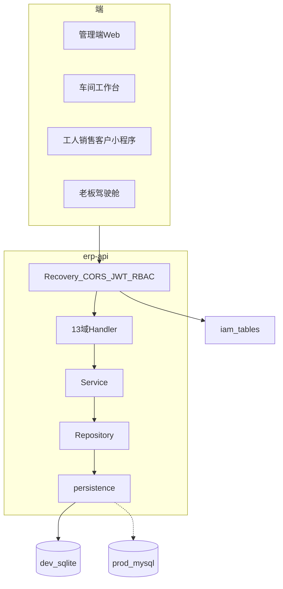
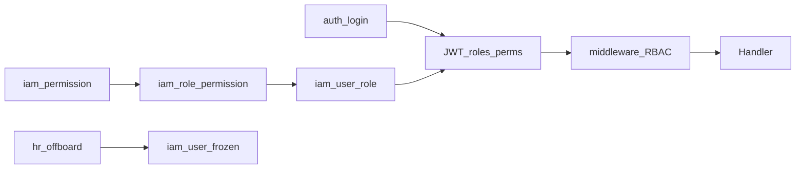

# 加工厂 ERP 系统框架设计

> **契约先行**：HTTP 唯一规范见 [openapi3.0-加工厂ERP.yaml](./openapi3.0-加工厂ERP.yaml)。  
> **功能边界**：[加工厂ERP系统框架设计文档.md](../加工厂ERP系统框架设计文档.md) 第 3 章 13 域。  
> **数据模型**：[加工厂ERP数据库模型.md](../加工厂ERP数据库模型.md)；开发 SQLite / 生产 MySQL。  
> **参考实现风格**：`ycwl-freetv-server-go`（Gin + 统一信封 + Bearer JWT，无 swag codegen）。

---

## 1. 目标与原则

| 原则 | 说明 |
|------|------|
| 契约先行 | 先改 OpenAPI，再改 handler；禁止另立业务域名 |
| 单二进制 | `erp-api` 同时服务管理端 Web、车间 Pad、小程序、老板端 |
| 统一信封 | `{ code, msg, data }`，`code=1` 成功，`code=0` 失败 |
| RBAC | 权限码 `核心功能:功能模块:动作`；一人多角色取并集 |
| 本地优先 | 开发默认 SQLite 文件库，零依赖启动；生产切 MySQL |

---

## 2. 逻辑架构



---

## 3. 仓库与包结构

```text
erp/
├── docs/                         # OpenAPI + 本框架说明
├── cmd/erp-api/main.go           # 入口
├── configs/
│   ├── erp.dev.yaml              # driver: sqlite
│   └── erp.prod.example.yaml     # driver: mysql
├── data/                         # 本地 sqlite（gitignore）
├── db/
│   ├── schema/                   # MySQL 生产 DDL
│   ├── sqlite/                   # SQLite 开发 DDL + seed
│   └── seed/
├── internal/
│   ├── app/                      # Bootstrap：配置/DB/中间件/路由
│   ├── api/                      # OK/Fail、BusinessError、分页
│   ├── middleware/               # CORS、JWT、permit-all、RBAC
│   ├── config/                   # Viper 风格 YAML + ERP_ 环境变量
│   ├── security/                 # JWT、密码哈希
│   ├── persistence/              # Open(driver)、Migrate、方言
│   ├── auth/                     # 登录/刷新/me
│   ├── iam/                      # 用户/分组/角色/权限/菜单/策略
│   ├── sales|crm|purchase|production|inventory|product|
│   │   asset|finance|payroll|hr|report|approval|system/
│   └── server/health/
├── demo/                         # 静态效果展示（已有）
└── README.md
```

包职责：

| 包 | 职责 |
|----|------|
| `app` | 组装 Gin Engine、注册 `/api/v1`、启动前 migrate |
| `api` | 响应结构与业务错误类型 |
| `middleware` | 鉴权白名单、JWT 解析、权限码校验、操作日志钩子 |
| `persistence` | `sqlite` / `mysql` 连接；开发库不存在时执行 schema+seed |
| 域包 | 仅 handlers（本阶段可占位）；后续补 service/repo |

---

## 4. API 约定

| 项 | 约定 |
|----|------|
| 前缀 | `/api/v1` |
| 字段 | snake_case |
| 分页 | `page_num`、`page_size`；响应 `list` + `total` |
| 鉴权 | `Authorization: Bearer <access_token>` |
| 白名单 | `/api/v1/health`、`/api/v1/auth/login`、`/api/v1/auth/refresh` |
| HTTP 状态 | 未登录 401、无权限 403；业务失败可用 200 + `code=0`，`msg` 为稳定错误码 |
| 权限码 | 如 `生产管理:扫码报工:新增` |

路由映射：

| 前缀 | 文档模块 |
|------|----------|
| `/api/v1/auth` | 登录会话 |
| `/api/v1/iam` | 人事·权限分配 + 系统·自定义权限/菜单/登录/冻结 |
| `/api/v1/hr` … `/api/v1/system` | 13 核心功能（路径段英文，Tag 用中文域名） |

英文路径段：`sales` `crm` `purchase` `production` `inventory` `product` `asset` `finance` `payroll` `hr` `report` `approval` `system`。

---

## 5. 数据库双驱动

### 5.1 配置

```yaml
# configs/erp.dev.yaml
server:
  addr: ":18080"
database:
  driver: sqlite          # sqlite | mysql
  sqlite_path: data/erp_dev.db
  # mysql_dsn: user:pass@tcp(127.0.0.1:3306)/erp_factory?parseTime=true&charset=utf8mb4
jwt:
  secret: "dev-only-change-me"
  access_ttl_min: 120
```

环境变量覆盖：`ERP_DATABASE_DRIVER`、`ERP_DATABASE_SQLITE_PATH`、`ERP_DATABASE_MYSQL_DSN`、`ERP_SERVER_ADDR`、`ERP_JWT_SECRET`。

### 5.2 类型映射（开发 SQLite）

| MySQL | SQLite |
|-------|--------|
| BIGINT PK AI | INTEGER PRIMARY KEY AUTOINCREMENT |
| DATETIME(3) | TEXT (ISO8601) |
| DECIMAL(18,4) | REAL（骨架）；生产回 DECIMAL |
| JSON | TEXT |
| TINYINT(1) | INTEGER 0/1 |

表名、字段名、业务含义与 [db/schema](../db/schema) **保持一致**。

### 5.3 启动流程

1. 读配置 `driver`
2. `sqlite`：若文件不存在或 `schema_meta` 未初始化 → 执行 `db/sqlite/schema.sql` + `seed.sql`
3. `mysql`：假定已用 `db/schema` + `install` 建好库（本阶段不自动跑 MySQL 迁移）

### 5.4 SQL 方言纪律

- 业务 SQL 使用 `?` 占位（两库均可）
- 禁止业务层 `ON DUPLICATE KEY`、MySQL 反引号函数等；需要时放 `persistence` 辅助函数
- 后期切生产：改 YAML `driver: mysql` + 导入 MySQL DDL，**不改域业务逻辑**

---

## 6. 鉴权与权限闭环



- 登录成功：`data` 含 `access_token`、`roles`、`permissions`
- `GET /auth/me`：当前用户、菜单裁剪结果、字段策略
- 管理员分组 / 角色 / 用户授权：见 OpenAPI `权限中心` Tag
- 成本隐藏：`iam_field_policy` + `pd_cost_hide_policy`

---

## 7. 中间件栈

顺序：`Recovery` → `RequestID/Log` → `CORS` → `JWT(permit-all)` → 路由级 `RequirePerm(code)` → Handler。

---

## 8. 与分期、演示站关系

| 阶段 | 后端重点 |
|------|----------|
| 本阶段 | 框架 + OpenAPI **1.1.0 全量 paths** + SQLite 种子 + auth/iam 可跑通 |
| 一期 | 产品/库存/生产/工资/人事/审批/系统按路径落库实现 |
| 二期 | 客户/销售/采购/报表（及对应审批） |
| 三期 | 财务/资产/BOM·MRP·委外及财务报表 |

路径实现清单：[openapi-路径全表.md](./openapi-路径全表.md)。静态 UI 演示：[demo/index.html](../demo/index.html)，后续对接本 API。

---

## 9. 开发 SOP

1. 改 [openapi3.0-加工厂ERP.yaml](./openapi3.0-加工厂ERP.yaml)（或改 `docs/gen_openapi_paths.py` 后重新生成）
2. （可选）`npx @redocly/cli lint docs/openapi3.0-加工厂ERP.yaml`
3. 实现/调整 `internal/{domain}` handler；未实现可返回 `NOT_IMPLEMENTED`
4. 本地：`go run ./cmd/erp-api`，默认加载 `configs/erp.dev.yaml`（端口 **18080**）
5. 验证：`GET /api/v1/health` → `POST /api/v1/auth/login`

---

## 10. 明确不做（本阶段）

- MQTT / 设备双平面
- oapi-codegen 全量生成
- 13 域完整业务实现
- 强制本机安装 MySQL
