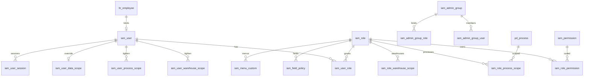

# 加工厂 ERP 数据库模型（物理设计）

> **依据**：[加工厂ERP逻辑数据模型.md](加工厂ERP逻辑数据模型.md)、[加工厂ERP系统框架设计文档.md](加工厂ERP系统框架设计文档.md) 第 7 章权限。  
> **引擎**：MySQL 8.0+ / InnoDB / utf8mb4  
> **脚本目录**：[db/](db/)  
> **安装**：在 `db` 目录执行 `powershell -File install.ps1`，或按 `schema/00`→`08` 顺序导入后执行 `seed/01_iam_seed.sql`。

---

## 1. 物理约定

| 项 | 约定 |
|----|------|
| 库名 | `erp_factory` |
| 主键 | `BIGINT` 自增（生产可换雪花，类型不变） |
| 金额/数量 | `DECIMAL(18,4)`；换算系数可用 `DECIMAL(18,8)` |
| 时间 | `DATETIME(3)` |
| 软删 | `is_deleted` + `deleted_at` + `deleted_by` |
| 审计 | `created_by/at`、`updated_by/at`、`version` |
| 表名前缀 | `sys_` 系统/组织 · `iam_` 权限 · `hr_` 人事 · `prd_` 产品 · `inv_` 库存 · `pd_` 生产 · `pay_` 工资 · `crm_` 客户 · `sl_` 销售 · `pur_` 采购 · `fin_` 财务 · `ast_` 资产 · `appr_` 审批 · `rpt_` 报表 |
| 库存事实源 | `inv_stock_txn` / `inv_stock_txn_line`；结存为投影 |
| 可用量 | 实物(`inv_balance`) − 待用(`inv_reservation`) ± 在途(`inv_in_transit`) |
| 权限码 | `核心功能:功能模块:动作` → `iam_permission.code` |

---

## 2. 权限模型（完整）

权限不新增第 3 章模块名，物理表支撑：**管理员管理、管理员分组、角色管理、权限分配、自定义权限、自定义菜单、登录控制、账户冻结、成本隐藏、数据/仓/工序范围**。



### 2.1 权限表清单

| 表名 | 说明 | 对应能力 |
|------|------|----------|
| `iam_user` | 登录用户；`user_type=admin/biz/line`；`status=active/frozen` | 管理员/用户管理、账户冻结 |
| `iam_admin_group` | 管理员分组 | 管理员分组 |
| `iam_admin_group_role` | 分组↔角色 | 分组绑定角色 |
| `iam_admin_group_user` | 分组↔用户 | 分组成员 |
| `iam_role` | 角色；`data_scope_type`；`is_system` 预置 | 角色管理 |
| `iam_user_role` | 用户↔角色（多对多，权限并集） | 权限分配 |
| `iam_permission` | 权限码 | 自定义权限 |
| `iam_role_permission` | 角色↔权限码 | 角色授权 |
| `iam_role_warehouse_scope` | 角色仓范围 | 仓范围 |
| `iam_role_process_scope` | 角色工序范围（可报工/可派工） | 工序范围 |
| `iam_user_warehouse_scope` | 用户仓范围（相对角色收紧） | 用户授权细化 |
| `iam_user_process_scope` | 用户工序范围 | 用户授权细化 |
| `iam_user_data_scope` | 用户数据范围覆盖 | 本人/班组/车间/仓库/全部 |
| `iam_field_policy` | 字段可见/可编辑 | 成本隐藏、字段策略 |
| `iam_menu_custom` | 按角色菜单显隐排序 | 自定义菜单 |
| `iam_login_policy` | 登录失败锁定、会话、密码规则 | 登录控制 |
| `iam_user_session` | 会话/强制下线 | 登录控制、冻结联动 |
| `iam_password_history` | 历史密码 | 登录控制 |
| `iam_onboard_role_template` | 入职默认角色 | 入职赋权 |
| `pd_cost_hide_policy` | 成本隐藏策略（角色级 JSON） | 生产·成本隐藏 |
| `hr_onboard` / `hr_offboard` | 入职/离职（`revoke_permission`） | 赋权/收回 |
| `sys_operation_log` | 操作审计 | 权限闭环审计 |

### 2.2 权限判定口径（实现约定）

1. **功能权限**：用户所有角色的 `iam_role_permission` **并集**。  
2. **菜单**：优先看 `iam_menu_custom`；无配置则按角色权限码推导可见模块。  
3. **数据范围**：若存在 `iam_user_data_scope` 则用之，否则取角色 `data_scope_type` 的最宽/或业务约定取并集策略（建议：**取最宽**需产品确认；默认实现建议 **取最严** 更安全）。本库设计支持两端：用户覆盖表存在即覆盖。  
4. **仓/工序**：用户范围表非空则 **取用户表与角色表交集**；用户表空则继承角色。  
5. **字段**：`iam_field_policy`；一线默认成本/毛利/他人工资 `visible=0`。  
6. **冻结**：`iam_user.status=frozen` 拒绝登录并吊销 `iam_user_session`。  
7. **离职**：`hr_offboard.revoke_permission=1` → 删/禁用 `iam_user_role`、清分组、冻结用户。

### 2.3 种子数据

见 [db/seed/01_iam_seed.sql](db/seed/01_iam_seed.sql)：

- 6 个管理员分组、13 个预置角色（文档 7.3）
- 登录策略、字段策略（成本隐藏）、权限码样例、admin 演示账号
- 计件工菜单裁剪样例

全量权限码建议由程序按「13 域 × 功能模块 × 动作」生成后写入 `iam_permission`（动作建议：`查看/新增/编辑/删除/审批/导出/打印`）。

---

## 3. 全库表目录（按前缀）

### 3.1 公共 / 组织 `sys_` / `pd_workshop`

| 表 | 说明 |
|----|------|
| sys_organization | 组织 |
| sys_department | 部门 |
| pd_workshop | 车间 |
| pd_work_team | 班组 |
| inv_warehouse | 仓库 |
| inv_location | 仓位 |
| sys_dict_type / sys_dict_item | 字典 |
| sys_code_rule | 编码规则 |
| sys_biz_calendar | 会计期间 |

### 3.2 产品 `prd_`

prd_product, prd_product_unit, prd_product_spec, prd_product_app_sort

### 3.3 库存 `inv_`

inv_balance, inv_stock_txn, inv_stock_txn_line, inv_reservation, inv_in_transit, inv_inbound_qc, inv_stocktake, inv_stocktake_line, inv_transfer, inv_transfer_line, inv_assemble_split, inv_assemble_split_line, inv_price_adjust, inv_box_code, inv_stock_alert_rule, inv_sales_peel_return, inv_material_to_payable

### 3.4 生产 `pd_`

pd_process, pd_process_price, pd_routing, pd_routing_step, pd_bom, pd_bom_line, pd_production_task, pd_production_task_item, pd_task_merge, pd_task_merge_line, pd_work_order, pd_dispatch, pd_material_requisition, pd_material_requisition_line, pd_report_work, pd_piecework_summary, pd_qc_order, pd_rework_order, pd_scrap_record, pd_drawing_link, pd_cost_hide_policy, pd_outsource_order, pd_consignment_order, pd_mrp_run, pd_mrp_result

### 3.5 工资 `pay_`

pay_worker_profile, pay_process_wage_rate, pay_payroll_sheet, pay_payroll_sheet_line, pay_payroll_adjust, pay_sales_commission_rule, pay_commission_calc

### 3.6 人事 `hr_`

hr_employee, hr_onboard, hr_offboard, hr_shift, hr_attendance_rule, hr_attendance_record, hr_leave_request, hr_overtime_patch, hr_attendance_month_stat, hr_performance_scheme, hr_performance_result, hr_attendance_perf_summary, hr_visit_record, hr_memo, hr_employee_journal, hr_personnel_transfer

### 3.7 客户 / 销售 / 采购

crm_*（客户、商机、跟进、分配、保护、释放、提醒、导入）  
sl_*（合同、锁价、询价、订单、预发货、发货、销售BOM、成本预算、报价试算、排行、改单日志）  
pur_*（供应商、申请、计划、入库、来料质检、退货、历史价、采购任务）

### 3.8 财务 / 资产

fin_*（科目、资金、流水、凭证、发票、核销、认款、预收预付、结汇、分摊、预警、对账、成本核算/溯源、合同利润、退货财务、往来调整、月结、小程序账单）  
ast_*（类别、卡片、转移）

### 3.9 审批 / 系统 / 报表

appr_flow, appr_node, appr_task, appr_expense_request, appr_affair_request  
sys_*（设置、打印、表格、公式、物流、单据策略、通知、提醒、公告、知识库、学堂、图纸、文档、操作日志、检索、财审、批量任务）  
rpt_report_definition, rpt_dashboard_widget, rpt_report_snapshot

---

## 4. 脚本文件结构

```
db/
├── install.ps1                 # Windows 一键拼接/导入
├── install_all.sql             # SOURCE 方式（需在 db 目录启动 mysql）
├── schema/
│   ├── 00_init.sql             # 建库
│   ├── 01_common.sql           # 组织仓字典
│   ├── 02_iam.sql              # 权限全量
│   ├── 03_product_inventory.sql
│   ├── 04_production_payroll.sql  # 含工序 FK 回补
│   ├── 05_hr.sql
│   ├── 06_crm_sales_purchase.sql
│   ├── 07_finance_asset.sql
│   └── 08_approval_system_report.sql
└── seed/
    └── 01_iam_seed.sql         # 角色/分组/权限码/字段策略/admin
```

---

## 5. 业务闭环与表映射

| 闭环 | 主表链 |
|------|--------|
| 生产计件 | pd_production_task → pd_work_order → pd_dispatch → pd_material_requisition → inv_stock_txn；pd_report_work → pd_piecework_summary → pay_process_wage_rate → pay_payroll_sheet_line |
| 采购入库 | pur_purchase_request → appr_task → pur_purchase_plan → pur_purchase_inbound → pur_incoming_qc → inv_stock_txn |
| 销售出库 | sl_inquiry → appr_task → sl_sales_order → sl_price_lock → sl_pre_shipment → inv_reservation → sl_delivery_approval → inv_stock_txn → fin_receipt_writeoff |
| 权限 | iam_permission + iam_menu_custom → iam_user_role → iam_login_policy / iam_user.status → sys_operation_log → hr_offboard |

---

## 6. 分期建表建议

| 分期 | 脚本重点 |
|------|----------|
| 一期 | 01+02+03+04+05+08（审批任务/系统基础）+ IAM 种子 |
| 二期 | 06（客户销售采购）+ 审批流完整 + 销售/打印设置 |
| 三期 | 07 财务资产 + BOM/MRP/委外受托 + 报表驾驶舱 + 知识图纸文档 |

---

## 7. 说明

1. 本模型为**完整物理库设计**，含权限子系统全部表。  
2. 演示账号 `admin` 的 `password_hash` 为占位，上线前必须替换。  
3. 跨域单据关联多用 `source_doc_type + source_doc_id` 多态，审批任务同理。  
4. `Consume` 逻辑并入 `inv_stock_txn.doc_type=consume`，未单独建耗用头表。  
5. 工序范围外键在 `04_production_payroll.sql` 中回补到 `pd_process`。
