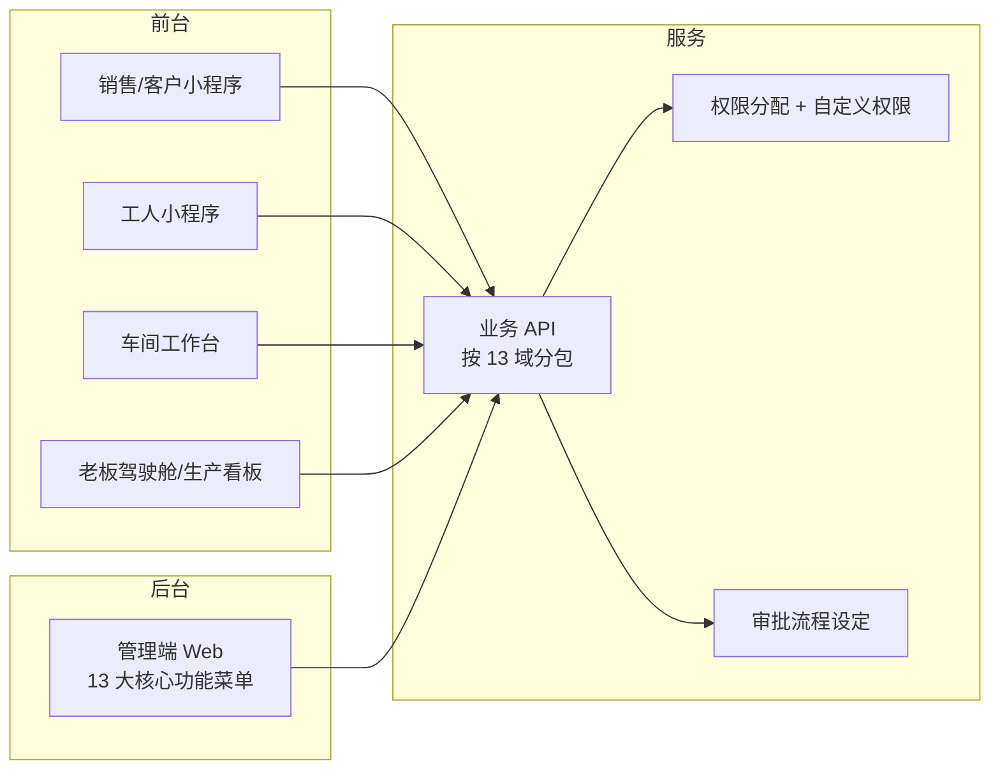

# 加工厂 ERP 系统框架设计文档（优化版）

> **功能基线**：严格以核心功能表（13 大域）为唯一功能清单，前后台功能点不增不减、不另立模块名。  
> **流程依据**：`pic.jpg` 工厂生产流程图（原料→工序→半成品→成品销售）。  
> **补充重点**：在「人事管理 · 权限分配」「系统管理 · 自定义权限」下细化权限落地设计。

---

## 1. 设计原则

| 原则 | 说明 |
|------|------|
| 功能以表为准 | 所有菜单、接口、页面均映射至表中「核心功能 → 功能模块」条目 |
| 前后台同域拆端 | 同一功能点可同时存在于后台（管理端）与前台（车间/小程序/自助），职责不同，名称一致 |
| 流程驱动配置 | 工艺流程、工序、报工、领料、入库按工厂产线配置，不另开「新业务模块」 |
| 权限可配置 | 通过权限分配 + 自定义权限 + 自定义菜单控制可见与可操作范围 |

---

## 2. 工厂流程与核心功能映射

产线节点仅作为**配置与使用场景**，功能仍落在表内模块：

```
原料入库 → 清洗 → 去皮(计件领料) → 收货 → 切断 → 去芯(计件算薪)
→ 收货 → 半成品入库 → 出库切块(计件) → 半成品入库 → 过筛装袋 → 成品入库销售
```

| 产线环节 | 落地表内功能模块 |
|----------|------------------|
| 原料入库 / 半成品入库 / 成品入库 | 库存管理（期初入库、出入库记录汇总、库存查询）；采购管理（采购入库） |
| 清洗 / 切断 / 过筛装袋等工序 | 生产管理（工序设置、工序管理、工艺流程、生产派工、扫码报工） |
| 去皮领料 / 出库切块 | 生产管理（联动式领料、扫码报工）；库存管理（物料调拨耗用） |
| 收货卡点 / 质检 | 生产管理（质检管理、进度跟踪）；库存管理（入库质检） |
| 计件算工钱 | 生产管理（计件工资）；工资管理（工序工资、薪酬核算、工资批量管理） |
| 成品销售 | 销售管理、客户管理、库存管理（可用量分析） |
| 采购补料 | 采购管理；审批管理（采购审批、采购计划单审批） |

---

## 3. 核心功能总表（唯一清单）

以下为系统**全部**核心功能与功能模块，前后台设计均不得超出本表范围。

| 核心功能 | 功能模块 |
|----------|----------|
| **销售管理** | 销售订单、自助下单、询价管理、合同管理、修改订单、发货审批、预发货管理、单据打印、订单复购、数据排行榜、销售锁价、询价审批、历史报价查询、销售BOM、我的订单、成本预算、报价计算器 |
| **客户管理** | CRM客户管理、商机管理、客户档案、客户跟进、资源分配、保护机制、释放机制、询价管理、导入客户、线索锁定、线索隐藏、任务提醒 |
| **采购管理** | 供应商管理、采购申请、采购计划单、采购入库、来料质检、采购退货、采购分析、历史价格查看、采购任务管理 |
| **生产管理** | 多单整合管理、生产任务单、图纸分发、工序设置、工序管理、工艺流程、生产派工、灵活派发工单、扫码报工、计件工资、自动BOM、MRP物料分析、联动式领料、车间工作台、车间管理、委外加工、受托加工生产流程管控、成本隐藏、一单多商品、进度跟踪、质检管理、返修单、废料管理 |
| **库存管理** | 库存查询、亏料预警、过量预警、入库质检、仓库盘点、车间盘点、仓库盘点记录、销售退皮、物料调拨耗用、商品调价组装拆分、物料转应付、在途量统计、待用量统计、可用量分析、期初入库、出入库记录汇总、采购退货、箱码管理 |
| **产品管理** | 产品档案、产品单位管理、APP产品排序、生产规格绑定 |
| **固定资产管理** | 固定资产类别、固定资产项目、固定资产内部转移、固定资产统计 |
| **财务管理** | 账目管理、交易流水账、收入支出明细、订单管理、小程序管理、凭证管理、发票管理、收款核单、外币结汇、结汇查询、分摊撤销、收款预警、出纳对账、预收预付管理、成本核算、合同利润、销售认款、销售退货退单、往来调整单、财务审批、资金管理、财务报表、成本明细溯源表、月度结转 |
| **工资管理** | 工人信息管理、工资批量管理、工序工资、薪酬核算、销售提成 |
| **人事管理** | 权限分配、入职登记、离职登记、考勤管理、班次管理、绩效管理、请假管理、考勤明细、加班补卡统计、考勤月度统计、考勤绩效汇总、外访明细、备忘录管理、员工日志 |
| **统计报表** | 企业报表、老板驾驶舱、生产看板、生产实况、客户询价查询、CRM统计、日统计报表、毛利润统计、质检报表、账目统计、出入库查询、收发存明细、跟进记录查询、销售重量统计、产品销售查询、系统物流查询、成本利润表、资产负债表、现金流量表、利润表 |
| **审批管理** | 任务管理、单据审核、费用财务审批、询价财务审批、询价明细审批、采购审批、采购计划单审批、事务申请审批、费用申请、考勤审批 |
| **系统管理** | 基础设置、自定义打印、自定义菜单、自定义权限、表格自定义、公式设置、销售设置、生产设置、物流信息管理、审批流程设定、人事调动、登录控制、批量改价、批量核算工资、单据审批、单据锁定、单据通知、单据编辑、单据删除、事项提醒、多条件检索、账户冻结、财审管控、学堂管理、知识库、图纸管理、文档管理、员工日志、操作日志、公告设置、备忘录 |

---

## 4. 端形态定义

| 端 | 定位 | 主要使用者 |
|----|------|------------|
| **后台** | 管理端 Web：主数据、单据全量处理、配置、核算、审批、报表管理 | 管理员、计划、仓管、销售内勤、采购、人事、财务、老板 |
| **前台** | 业务作业端：小程序 / 车间工作台 / 自助端 / 看板只读 | 计件工、固定工、车间、销售外勤、客户自助、老板巡检 |

> 说明：表中模块名称前后台统一；「前台有、后台无」仅表示该端不承载该操作界面，数据仍归一库。

---

## 5. 后台功能点设计（严格对照表）

后台菜单与表「核心功能」一一对应，子菜单 = 功能模块。

### 5.1 销售管理（后台）

| 功能模块 | 后台能力 |
|----------|----------|
| 销售订单 | 订单列表/新建/详情、状态流转、关联库存与发货 |
| 询价管理 | 询价单录入、跟进、转订单 |
| 合同管理 | 合同归档、关联订单与利润 |
| 修改订单 | 变更记录、受单据锁定/审批约束 |
| 发货审批 | 发货单审核通过/驳回 |
| 预发货管理 | 预发货计划、占用可用量 |
| 单据打印 | 调用自定义打印模板 |
| 订单复购 | 历史订单一键复购生成 |
| 数据排行榜 | 销售业绩排行配置与查看 |
| 销售锁价 | 锁价策略维护与生效 |
| 询价审批 | 询价单审批处理 |
| 历史报价查询 | 按客户/产品查历史报价 |
| 销售BOM | 订单级BOM维护 |
| 我的订单 | 按业务员过滤的订单工作台 |
| 成本预算 | 订单成本测算（受成本隐藏/权限控制） |
| 报价计算器 | 报价试算并回写询价/订单 |

> **自助下单**：后台侧为订单来源管理、规则与单据承接；下单操作界面见前台。

### 5.2 客户管理（后台）

| 功能模块 | 后台能力 |
|----------|----------|
| CRM客户管理 | 客户全生命周期管理 |
| 商机管理 | 商机阶段、转化 |
| 客户档案 | 档案字段维护 |
| 客户跟进 | 跟进记录、任务 |
| 资源分配 | 客户/线索分配至业务员 |
| 保护机制 | 保护期规则配置与执行 |
| 释放机制 | 到期释放、回收公海 |
| 询价管理 | 客户侧询价关联（与销售域协同） |
| 导入客户 | Excel/批量导入 |
| 线索锁定 | 锁定归属 |
| 线索隐藏 | 按权限隐藏线索 |
| 任务提醒 | 跟进/任务提醒规则 |

### 5.3 采购管理（后台）

| 功能模块 | 后台能力 |
|----------|----------|
| 供应商管理 | 供应商档案、评级 |
| 采购申请 | 申请单编制与提交审批 |
| 采购计划单 | 计划编制、汇总 |
| 采购入库 | 入库单、过账至库存 |
| 来料质检 | 质检单、合格入库/退货 |
| 采购退货 | 退货单与库存回冲 |
| 采购分析 | 采购量价分析 |
| 历史价格查看 | 供应商历史价 |
| 采购任务管理 | 采购任务分派与跟踪 |

### 5.4 生产管理（后台）— 对接工厂产线

| 功能模块 | 后台能力 | 产线用途 |
|----------|----------|----------|
| 多单整合管理 | 多销售/生产单合并排产 | 批量投产 |
| 生产任务单 | 任务下达、关闭 | 整单跟踪 |
| 图纸分发 | 图纸挂接任务/工序 | 现场查看来源 |
| 工序设置 | 工序主数据（清洗/去皮/切断/去芯/切块/装袋等） | 产线节点 |
| 工序管理 | 工序启用、工价关联入口 | 计件基础 |
| 工艺流程 | 工艺路线顺序、入库卡点 | 12 步流程建模 |
| 生产派工 | 派工到班组/工人 | 固定工/计件工 |
| 灵活派发工单 | 临时加派、改派 | 现场调度 |
| 扫码报工 | 报工记录查询、纠错（受权限） | 产量采集 |
| 计件工资 | 计件产量汇总、与工资管理衔接 | 去皮/去芯/切块 |
| 自动BOM | BOM 生成与维护 | 用料 |
| MRP物料分析 | 物料需求运算 | 缺料预警联动 |
| 联动式领料 | 领料单与派工/报工联动 | 工人领料 |
| 车间工作台 | 车间运营总览配置 | 管理视角 |
| 车间管理 | 车间档案、归属 | 组织 |
| 委外加工 | 委外单全流程 | 外部工序 |
| 受托加工生产流程管控 | 受托单进度 | 来料加工 |
| 成本隐藏 | 角色级成本字段隐藏策略 | 一线不可见成本 |
| 一单多商品 | 任务/订单多 SKU | 混单 |
| 进度跟踪 | 工序进度看板数据 | 收货卡点可视 |
| 质检管理 | 过程/成品检单据 | 收货质量控制 |
| 返修单 | 返修流转 | 不合格回流 |
| 废料管理 | 废料登记与去向 | 损耗 |

### 5.5 库存管理（后台）— 原料/半成品/成品仓

| 功能模块 | 后台能力 |
|----------|----------|
| 库存查询 | 分仓库存、批次/箱码查询 |
| 亏料预警 | 阈值与消息 |
| 过量预警 | 阈值与消息 |
| 入库质检 | 入库质检单 |
| 仓库盘点 | 盘点单、盈亏处理 |
| 车间盘点 | 车间在制/现场盘点 |
| 仓库盘点记录 | 历史盘点归档 |
| 销售退皮 | 退皮规则与单据 |
| 物料调拨耗用 | 仓间调拨、生产耗用出库 |
| 商品调价组装拆分 | 调价、组装拆分单 |
| 物料转应付 | 耗用转应付 |
| 在途量统计 | 采购/调拨在途 |
| 待用量统计 | 订单/工单占用 |
| 可用量分析 | 可用 = 实物 − 待用 ± 在途 |
| 期初入库 | 上线期初 |
| 出入库记录汇总 | 流水与汇总 |
| 采购退货 | 与采购域退货过账 |
| 箱码管理 | 箱码生成、绑定、追溯 |

### 5.6 产品管理（后台）

| 功能模块 | 后台能力 |
|----------|----------|
| 产品档案 | SKU/物料档案 |
| 产品单位管理 | 多单位、换算 |
| APP产品排序 | 前台展示序维护 |
| 生产规格绑定 | 规格与工艺/工价绑定 |

### 5.7 固定资产管理（后台）

| 功能模块 | 后台能力 |
|----------|----------|
| 固定资产类别 | 类别树 |
| 固定资产项目 | 资产卡片 |
| 固定资产内部转移 | 部门/位置转移 |
| 固定资产统计 | 统计报表 |

### 5.8 财务管理（后台）

| 功能模块 | 后台能力 |
|----------|----------|
| 账目管理 | 账户/科目体系 |
| 交易流水账 | 流水登记查询 |
| 收入支出明细 | 收支明细 |
| 订单管理 | 订单财务视角 |
| 小程序管理 | 小程序支付/账单相关配置与对账 |
| 凭证管理 | 凭证录入审核 |
| 发票管理 | 开票/收票 |
| 收款核单 | 收款与订单核销 |
| 外币结汇 | 结汇业务 |
| 结汇查询 | 结汇记录 |
| 分摊撤销 | 费用分摊与撤销 |
| 收款预警 | 逾期/未收预警 |
| 出纳对账 | 出纳对账作业 |
| 预收预付管理 | 预收预付台账 |
| 成本核算 | 生产成本归集 |
| 合同利润 | 合同维度利润 |
| 销售认款 | 认款单 |
| 销售退货退单 | 退货财务处理 |
| 往来调整单 | 往来调整 |
| 财务审批 | 财务类单据审批入口 |
| 资金管理 | 资金账户与调拨 |
| 财务报表 | 报表生成导出 |
| 成本明细溯源表 | 成本穿透至报工/领料 |
| 月度结转 | 月结 |

### 5.9 工资管理（后台）

| 功能模块 | 后台能力 |
|----------|----------|
| 工人信息管理 | 工人工资档案（与人事协同） |
| 工资批量管理 | 批量生成/调整工资单 |
| 工序工资 | 工序工价表（对接去皮/去芯/切块） |
| 薪酬核算 | 计件+考勤+提成汇总核算 |
| 销售提成 | 提成规则与计算 |

### 5.10 人事管理（后台）

| 功能模块 | 后台能力 |
|----------|----------|
| **权限分配** | 用户绑定角色、功能权限、数据范围（详见第 7 章） |
| 入职登记 | 入职流程与建档 |
| 离职登记 | 离职与权限回收 |
| 考勤管理 | 考勤规则、打卡数据 |
| 班次管理 | 班次定义（对接车间排班） |
| 绩效管理 | 绩效方案与结果 |
| 请假管理 | 请假单 |
| 考勤明细 | 明细查询 |
| 加班补卡统计 | 加班/补卡统计 |
| 考勤月度统计 | 月汇总 |
| 考勤绩效汇总 | 考勤×绩效 |
| 外访明细 | 外访记录 |
| 备忘录管理 | 人事备忘 |
| 员工日志 | 员工日志查看 |

### 5.11 统计报表（后台）

| 功能模块 | 后台能力 |
|----------|----------|
| 企业报表 | 综合报表中心 |
| 老板驾驶舱 | 经营指标配置与查看 |
| 生产看板 | 产量/进度看板 |
| 生产实况 | 实时产线状态 |
| 客户询价查询 | 询价统计查询 |
| CRM统计 | CRM 漏斗/转化 |
| 日统计报表 | 日报 |
| 毛利润统计 | 毛利分析 |
| 质检报表 | 质检合格率等 |
| 账目统计 | 账目汇总 |
| 出入库查询 | 出入库明细查询 |
| 收发存明细 | 收发存报表 |
| 跟进记录查询 | 客户跟进查询 |
| 销售重量统计 | 按重量销售统计（贴合加工厂计量） |
| 产品销售查询 | 产品维度销售 |
| 系统物流查询 | 物流状态查询 |
| 成本利润表 | 成本利润 |
| 资产负债表 | 资产负债 |
| 现金流量表 | 现金流 |
| 利润表 | 利润 |

### 5.12 审批管理（后台）

| 功能模块 | 后台能力 |
|----------|----------|
| 任务管理 | 待办/已办审批任务 |
| 单据审核 | 通用单据审核入口 |
| 费用财务审批 | 费用类 |
| 询价财务审批 | 询价财务节点 |
| 询价明细审批 | 询价行明细审批 |
| 采购审批 | 采购申请/订单审批 |
| 采购计划单审批 | 计划单审批 |
| 事务申请审批 | 事务类申请 |
| 费用申请 | 费用申请单 |
| 考勤审批 | 请假/加班/补卡审批 |

### 5.13 系统管理（后台）

| 功能模块 | 后台能力 |
|----------|----------|
| 基础设置 | 组织、字典、仓库等基础参数 |
| 自定义打印 | 打印模板 |
| 自定义菜单 | 菜单显隐/排序（按角色） |
| **自定义权限** | 权限码、角色权限集、字段策略（详见第 7 章） |
| 表格自定义 | 列表字段自定义 |
| 公式设置 | 业务计算公式 |
| 销售设置 | 销售域参数 |
| 生产设置 | 生产域参数（报工校验、领料联动等） |
| 物流信息管理 | 物流承运商/轨迹接口参数 |
| 审批流程设定 | 审批流可视化配置 |
| 人事调动 | 组织岗位调动 |
| 登录控制 | 登录策略、会话 |
| 批量改价 | 产品批量改价 |
| 批量核算工资 | 触发工资批量核算 |
| 单据审批 | 单据是否需审开关 |
| 单据锁定 | 锁定规则 |
| 单据通知 | 通知规则 |
| 单据编辑 | 可编辑策略 |
| 单据删除 | 删除策略 |
| 事项提醒 | 提醒中心 |
| 多条件检索 | 全局检索配置 |
| 账户冻结 | 用户冻结 |
| 财审管控 | 财务审核强控开关 |
| 学堂管理 | 培训内容 |
| 知识库 | 知识条目 |
| 图纸管理 | 图纸库（供图纸分发） |
| 文档管理 | 文档库 |
| 员工日志 | 日志策略 |
| 操作日志 | 审计日志查询 |
| 公告设置 | 公告 |
| 备忘录 | 系统备忘 |

---

## 6. 前台功能点设计（严格对照表）

前台不新增表外功能；仅承载适合移动端/车间端/自助端的**作业与查询**子集。

### 6.1 前台 × 核心功能对照

| 核心功能 | 前台承载的功能模块 | 端形态 |
|----------|-------------------|--------|
| 销售管理 | 自助下单、询价管理（提交/查看）、我的订单、订单复购、历史报价查询、报价计算器（简易）、发货进度查看、单据打印（分享/预览） | 销售小程序 / 客户自助 |
| 客户管理 | 客户跟进、任务提醒、商机快录、外勤相关线索查看（受保护/隐藏机制） | 销售小程序 |
| 采购管理 | 采购任务查看、到货确认辅助、来料质检录入（现场） | 采购/质检移动端 |
| 生产管理 | 车间工作台、生产派工接收、灵活派发（主任）、扫码报工、联动式领料、图纸查看、进度跟踪、质检录入、返修/废料登记 | **车间工作台 / 工人端** |
| 库存管理 | 库存查询（授权仓）、扫码出入库确认、箱码扫描、盘点扫码、亏料/过量预警消息 | 仓管 Pad / 小程序 |
| 产品管理 | APP产品排序结果展示、生产规格选择 | 小程序 / 车间 |
| 固定资产管理 | 资产查询、内部转移申请（若审批开启） | 移动端 |
| 财务管理 | 小程序管理相关收付款入口、收款预警消息、销售认款（移动审批协同） | 财务/销售小程序 |
| 工资管理 | 工人查看本人计件/工资结果（只读）、提成个人查询 | 工人小程序 |
| 人事管理 | 考勤打卡、请假申请、加班补卡申请、员工日志、备忘录 | 全员小程序 |
| 统计报表 | 老板驾驶舱、生产看板、生产实况（只读刷新） | 老板端 / 车间大屏 |
| 审批管理 | 任务管理（待办审批）、单据审核、各类审批处理 | 审批小程序 |
| 系统管理 | 公告查看、事项提醒、学堂/知识库/图纸/文档只读、登录控制（改密等） | 各前台 |

### 6.2 车间前台作业流（功能点全部来自表内）

对应工厂流程图，前台操作只使用生产/库存等表内模块：

| 步骤 | 前台操作 | 表内功能模块 |
|------|----------|--------------|
| 1 | 查看今日任务 | 车间工作台、生产任务单（只读）、进度跟踪 |
| 2 | 领料 | 联动式领料；库存：物料调拨耗用 |
| 3 | 去皮/去芯/切块报工 | 扫码报工；计件工资（产量写入） |
| 4 | 固定工收货确认 | 扫码报工 / 质检管理（按生产设置） |
| 5 | 半成品/成品入库 | 库存出入库；箱码管理 |
| 6 | 看本人工钱 | 工资管理（本人只读）；成本隐藏保证不见成本 |

### 6.3 销售/客户前台作业流

| 步骤 | 前台操作 | 表内功能模块 |
|------|----------|--------------|
| 1 | 客户询价 | 询价管理 |
| 2 | 自助下单 / 复购 | 自助下单、订单复购、我的订单 |
| 3 | 锁价/合同内订单跟踪 | 销售锁价、合同管理（只读）、预发货状态 |
| 4 | 跟进与提醒 | 客户跟进、任务提醒 |

---

## 7. 权限管理细化（表内功能的设计展开）

权限不新增核心功能名，全部落在：

- **人事管理 → 权限分配**
- **系统管理 → 自定义权限 / 自定义菜单 / 登录控制 / 账户冻结 / 成本隐藏（生产管理） / 财审管控 / 单据锁定·编辑·删除**

### 7.1 权限分配（人事管理）做什么

| 配置项 | 说明 |
|--------|------|
| 用户 ↔ 角色 | 一人多角色，权限并集 |
| 角色 ↔ 功能模块 | 勾选第 3 章表中的功能模块（菜单+按钮） |
| 数据范围 | 本人 / 本班组 / 本车间 / 本仓库 / 全部 |
| 仓范围 | 原料仓、半成品仓、成品仓等可多选 |
| 工序范围 | 可报工/可派工的工序（对接工序管理） |
| 入职赋权 / 离职收回 | 与入职登记、离职登记联动 |

### 7.2 自定义权限（系统管理）做什么

| 配置项 | 说明 |
|--------|------|
| 权限码 | 按「核心功能:功能模块:动作」生成，如 `生产管理:扫码报工:新增` |
| 字段策略 | 配合成本隐藏：成本、毛利、他人工资字段可见/隐藏 |
| 自定义菜单 | 按角色裁剪 13 大域菜单树 |
| 与审批流程设定联动 | 无权限不可提交；审批人解析 |
| 与财审管控、单据锁定联动 | 超权限操作拦截 |

### 7.3 预置角色与表内模块授权（示例）

| 角色 | 授权的核心功能（模块按需勾选） |
|------|-------------------------------|
| 系统管理员 | 系统管理全模块 + 人事管理·权限分配 |
| 老板 | 统计报表（老板驾驶舱等）、财务管理只读/审批、审批管理 |
| 销售员 | 销售管理、客户管理（受资源分配/保护/隐藏） |
| 采购员 | 采购管理、审批管理（采购类） |
| 仓管员 | 库存管理（按仓）、采购入库/退货协同 |
| 生产计划 | 生产管理（任务/派工/工艺/MRP/BOM等） |
| 车间主任 | 车间工作台、派工、进度、质检、灵活派发 |
| 计件工 | 前台：扫码报工、联动式领料、本人工资只读 |
| 固定工 | 前台：授权工序扫码报工、收货/质检 |
| 质检员 | 来料质检、入库质检、质检管理、质检报表 |
| 人事 | 人事管理、考勤审批相关 |
| 薪资员 | 工资管理、系统管理·批量核算工资 |
| 财务 | 财务管理、相关审批、财审管控范围内操作 |

### 7.4 产线操作与权限（仍映射表内模块）

| 产线动作 | 功能模块 | 默认角色 |
|----------|----------|----------|
| 原料/成品入出库 | 库存管理相关模块 | 仓管员 |
| 领料 | 联动式领料 | 计件工、车间主任 |
| 计件报工 | 扫码报工、计件工资 | 计件工 |
| 收货/切断等 | 扫码报工、质检管理 | 固定工 |
| 看成本 | 成本预算/成本核算等 | 财务、老板（成本隐藏对其关闭） |
| 算薪 | 工序工资、薪酬核算、工资批量管理、批量核算工资 | 薪资员、财务 |

---

## 8. 前后台架构（支撑表内功能，不扩展业务域）

### 8.1 应用划分



### 8.2 后端包结构 = 13 核心功能

```
erp-api/
├── sales/          # 销售管理
├── crm/            # 客户管理
├── purchase/       # 采购管理
├── production/     # 生产管理
├── inventory/      # 库存管理
├── product/        # 产品管理
├── asset/          # 固定资产管理
├── finance/        # 财务管理
├── payroll/        # 工资管理
├── hr/             # 人事管理（含权限分配）
├── report/         # 统计报表
├── approval/       # 审批管理
└── system/         # 系统管理（含自定义权限）
```

### 8.3 后台菜单树（与表一致）

```
销售管理
客户管理
采购管理
生产管理
库存管理
产品管理
固定资产管理
财务管理
工资管理
人事管理
统计报表
审批管理
系统管理
```

每个核心功能下的二级菜单 = 第 3 章「功能模块」列，通过**自定义菜单**按角色裁剪。

### 8.4 前台信息架构（不改模块名）

**工人小程序**：扫码报工 · 联动式领料 · 我的计件/工资 · 考勤/请假 · 公告提醒  
**车间工作台**：车间工作台 · 生产派工 · 进度跟踪 · 质检/返修/废料 · 库存扫码  
**销售小程序**：自助下单 · 我的订单 · 询价 · 客户跟进 · 任务提醒  
**老板端**：老板驾驶舱 · 生产看板 · 生产实况 · 毛利润/关键报表只读  

---

## 9. 关键业务闭环（模块组合，不新增功能名）

### 9.1 生产计件闭环

`生产任务单` → `生产派工`/`灵活派发工单` → `联动式领料` → `扫码报工` → `计件工资` → `工序工资`/`薪酬核算`/`工资批量管理`（可经 `批量核算工资`）→ 审批（如启用）

### 9.2 采购入库闭环

`采购申请` → `采购审批`/`采购计划单审批` → `采购计划单` → `采购入库` → `来料质检` → 库存 `出入库记录汇总`；不合格走 `采购退货`

### 9.3 销售出库闭环

`询价管理` → `询价审批`/`询价财务审批` → `销售订单`/`自助下单` → `销售锁价` → `发货审批`/`预发货管理` → 库存出库 → `收款核单`/`销售认款`

### 9.4 权限闭环

`自定义权限` + `自定义菜单` 定义能力 → `权限分配` 赋给用户 → `登录控制`/`账户冻结` 管控访问 → `操作日志` 审计 → `离职登记` 收回

---

## 10. 分期实施（按表内模块优先级）

| 阶段 | 纳入的核心功能与模块 |
|------|----------------------|
| **一期** | 产品管理全模块；库存管理（查询/入出库/盘点/可用量/预警/箱码）；生产管理（工序/工艺/任务/派工/扫码报工/领料/车间工作台/进度/计件工资/质检）；工资管理全模块；人事管理（权限分配、入离职、考勤班次）；系统管理（基础设置、生产设置、自定义权限/菜单、登录控制、操作日志）；审批管理（单据审核、考勤审批） |
| **二期** | 客户管理、销售管理全模块；采购管理全模块；统计报表（生产看板/实况、出入库、收发存、日统计）；审批（采购/询价类）；系统（销售设置、打印、审批流程设定） |
| **三期** | 财务管理全模块；固定资产；统计报表财务三表与老板驾驶舱/毛利；委外/受托、MRP/自动BOM、成本隐藏与成本溯源；学堂/知识库/图纸/文档等系统模块完善 |

---

## 11. 文档结论

1. **功能范围**：仅第 3 章核心功能表，共 13 域；前后台都是对表内「功能模块」的端侧实现差异，不改名、不扩域。  
2. **后台**：13 顶栏菜单，二级 = 功能模块，承担配置、全量单据、核算、权限与审批。  
3. **前台**：车间工作台 / 工人与销售小程序 / 看板，只实现表内适合现场与移动的模块子集。  
4. **工厂流程**：通过生产管理（工艺流程、工序、派工、报工、领料）+ 库存管理（多仓入出库）配置实现，不另建流程系统。  
5. **权限**：在「权限分配」「自定义权限」内落地角色、菜单、按钮、仓/工序数据范围及成本隐藏，满足计件与固定工分权。
