# 加工厂 ERP 逻辑数据模型

> **定位**：逻辑模型（实体 / 关键字段 / 关系），作为后续物理库表设计的依据。  
> **依据**：[加工厂ERP系统框架设计文档.md](加工厂ERP系统框架设计文档.md)（13 大域功能表 + 第 9 章业务闭环 + 第 10 章分期）。  
> **不包含**：DDL、字段类型、索引、分表、具体数据库选型。  
> **分期**：实体「分期」列对齐实施阶段；一期优先建表，二/三期实体先保留逻辑定义。

---

## 1. 建模约定

### 1.1 命名

| 约定 | 说明 |
|------|------|
| 实体名 | PascalCase 英文逻辑名；中文名用于业务对照 |
| 主键 | 统一逻辑主键 `id`（物理实现可为雪花/UUID/自增，本阶段不定） |
| 业务编码 | `xxx_no` / `code`，单据号按编码规则生成，业务唯一 |
| 外键 | `{关联实体}_id`，如 `product_id`、`warehouse_id` |
| 布尔/开关 | `is_xxx` / `need_xxx` |
| 金额/数量 | `amount`（金额）、`qty`（数量）、`weight`（重量，贴合加工厂计量） |

### 1.2 单据头行模式

业务单据统一拆为 **Header + Line**：

| 模式 | 头表字段（共性） | 行表字段（共性） |
|------|------------------|------------------|
| 单据头 | `id`, `doc_no`, `doc_type`, `status`, `biz_date`, `org_id`, `dept_id`, `owner_user_id`, `remark`, 审批相关, 审计字段 | — |
| 单据行 | — | `id`, `header_id`, `line_no`, `product_id`, `unit_id`, `qty`, `weight`, `price`, `amount`, `remark` |

`doc_type` 区分同类流水（如库存 `StockTxn.doc_type` = 采购入库/生产领料/销售出库/盘盈盘亏/调拨/期初等）。

### 1.3 审计与软删除

所有业务实体默认具备：

| 字段 | 说明 |
|------|------|
| `created_by` / `created_at` | 创建人、创建时间 |
| `updated_by` / `updated_at` | 最后修改人、时间 |
| `is_deleted` / `deleted_at` / `deleted_by` | 软删除（物理删除策略留待库设计） |
| `version` | 乐观锁（可选，单据编辑冲突时用） |

### 1.4 通用状态

| 状态族 | 典型值 | 适用 |
|--------|--------|------|
| 单据流转 | `draft` / `submitted` / `approving` / `approved` / `rejected` / `posted` / `closed` / `cancelled` | 采购、销售、生产、库存、财务单据 |
| 主数据 | `active` / `inactive` | 产品、客户、供应商、工序、仓库 |
| 任务/工单 | `pending` / `dispatched` / `in_progress` / `completed` / `closed` | 生产任务、派工、报工 |

具体状态子集由各域单据裁剪，物理枚举表或字典统一维护。

### 1.5 多单位与换算

- 产品可有多个计量单位（`ProductUnit`），其中一个为**库存主单位**。
- 换算关系存 `UnitConversion`（或挂在 `ProductUnit.factor_to_base`）。
- 单据行同时记：`unit_id`、`qty`（单据单位）、`base_qty`（主单位数量），过账一律用主单位。

### 1.6 可用量口径（硬约定）

```
可用量 = 实物结存 − 待用量 + 在途量（按业务开关可配置是否计入在途）
```

| 量 | 事实来源 |
|----|----------|
| 实物结存 | `InventoryBalance.qty`（由 `StockTxn` 过账维护，可重算校验） |
| 待用量 | `Reservation`（订单占用、预发货占用、工单占用等） |
| 在途量 | `InTransit`（采购在途、调拨在途） |

**库存唯一业务事实源**：`StockTxn`（含行）。结存表为投影，禁止无流水改结存（盘点盈亏、期初亦生成流水）。

### 1.7 工序「收货」口径

工厂流程图中的「收货」为**工序交接/数量质量卡点**，建模为 `ReportWork`（报工类型=交接确认）和/或 `QCOrder`，**不与采购收货/采购入库混表**。

### 1.8 权限码格式

```
核心功能:功能模块:动作
```

示例：`生产管理:扫码报工:新增`。落 `PermissionCode.code`。

### 1.9 计件三单匹配

```
领料量（MaterialRequisition） → 交收/报工量（ReportWork） → 工价（ProcessWageRate） → 计件汇总（PieceworkSummary）
```

---

## 2. 公共 / 组织主数据

> 归属：系统管理 · 基础设置；被各域引用。分期：**一期**。

| 实体 | 中文名 | 主键 | 关键字段 | 关联 | 分期 |
|------|--------|------|----------|------|------|
| Organization | 组织/公司 | id | code, name, status | — | 一期 |
| Department | 部门 | id | org_id, parent_id, code, name | Organization | 一期 |
| Workshop | 车间 | id | org_id, dept_id, code, name, status | Organization, Department | 一期 |
| WorkTeam | 班组 | id | workshop_id, code, name, leader_employee_id | Workshop, Employee | 一期 |
| Warehouse | 仓库 | id | org_id, code, name, warehouse_type(原料/半成品/成品/废料/其他), status | Organization | 一期 |
| Location | 仓位/货位 | id | warehouse_id, code, name | Warehouse | 一期 |
| DictType | 字典类型 | id | code, name | — | 一期 |
| DictItem | 字典项 | id | dict_type_id, code, name, sort_no, ext_json | DictType | 一期 |
| CodeRule | 编码规则 | id | biz_type, prefix, date_pattern, seq_length, current_seq | — | 一期 |
| BizCalendar | 业务日历/会计期间 | id | year, period_no, start_date, end_date, is_closed | — | 一期/三期财务强化 |

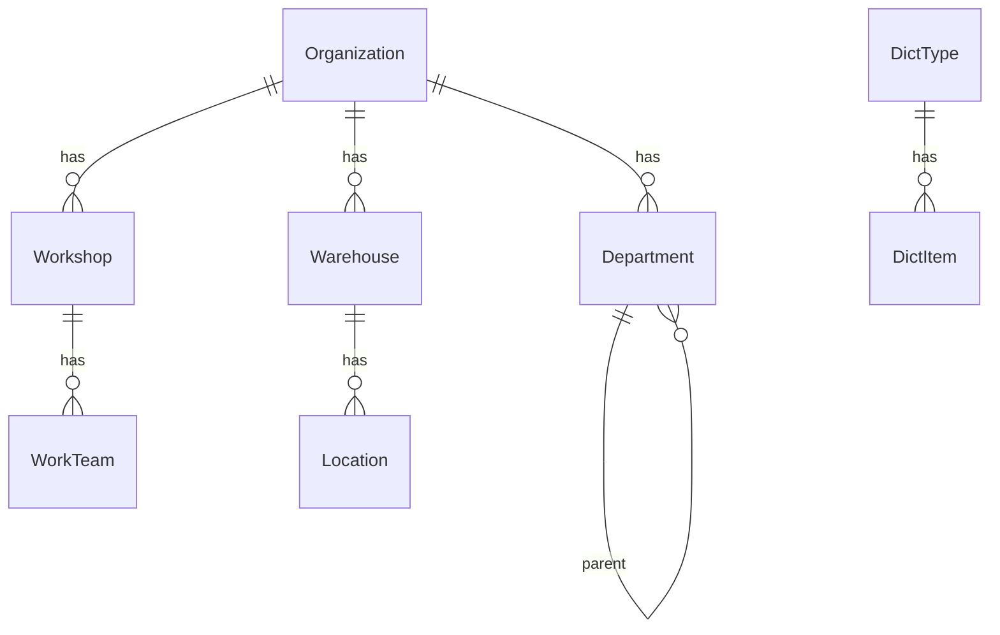

---

## 3. 产品管理

| 实体 | 中文名 | 主键 | 关键字段 | 关联 | 分期 |
|------|--------|------|----------|------|------|
| Product | 产品/物料档案 | id | code, name, category, product_type(原料/半成品/成品/辅料/废料副产), base_unit_id, spec_text, barcode, status, cost_price, sale_price, is_batch_managed, is_box_managed | ProductUnit | 一期 |
| ProductUnit | 产品单位 | id | product_id, unit_name, is_base, factor_to_base, is_purchase, is_sale, is_stock | Product | 一期 |
| UnitConversion | 单位换算（可选独立） | id | product_id, from_unit_id, to_unit_id, factor | Product, ProductUnit | 一期 |
| ProductSpec | 生产规格绑定 | id | product_id, spec_code, routing_id, process_wage_bind_json, remark | Product, Routing | 一期 |
| ProductAppSort | APP 产品排序 | id | product_id, channel, sort_no, is_visible | Product | 一期 |

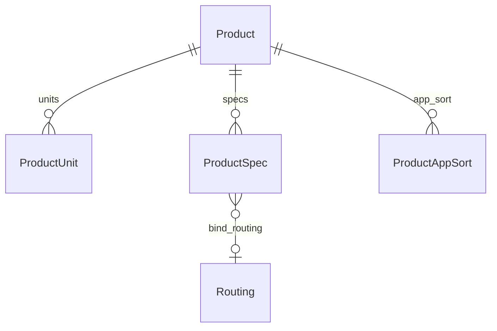

**功能映射**：产品档案、产品单位管理、APP产品排序、生产规格绑定。

---

## 4. 库存管理

| 实体 | 中文名 | 主键 | 关键字段 | 关联 | 分期 |
|------|--------|------|----------|------|------|
| InventoryBalance | 库存结存 | id | warehouse_id, location_id, product_id, batch_no, box_code_id, qty, weight, avg_cost | Warehouse, Location, Product, BoxCode | 一期 |
| StockTxn | 出入库流水头 | id | doc_no, doc_type, biz_date, status, warehouse_id, counterparty_type, counterparty_id, source_doc_type, source_doc_id, posted_at | Warehouse | 一期 |
| StockTxnLine | 出入库流水行 | id | txn_id, line_no, product_id, unit_id, qty, base_qty, weight, batch_no, box_code_id, location_id, direction(in/out), amount | StockTxn, Product | 一期 |
| Reservation | 待用/占用 | id | warehouse_id, product_id, batch_no, qty, source_doc_type, source_doc_id, source_line_id, status(active/released) | Product, Warehouse | 一期 |
| InTransit | 在途量 | id | product_id, warehouse_id(目标), qty, transit_type(purchase/transfer), source_doc_type, source_doc_id, status | Product | 一期 |
| InboundQC | 入库质检 | id | doc_no, stock_txn_id, product_id, qty_check, qty_pass, qty_fail, result, inspector_id, status | StockTxn, Product, Employee | 一期 |
| Stocktake | 盘点单头 | id | doc_no, stocktake_type(warehouse/workshop), warehouse_id, workshop_id, biz_date, status | Warehouse, Workshop | 一期 |
| StocktakeLine | 盘点行 | id | stocktake_id, product_id, book_qty, count_qty, diff_qty, batch_no, location_id | Stocktake, Product | 一期 |
| Transfer | 调拨单头 | id | doc_no, from_warehouse_id, to_warehouse_id, status, biz_date | Warehouse | 一期 |
| TransferLine | 调拨行 | id | transfer_id, product_id, qty, base_qty, batch_no | Transfer, Product | 一期 |
| Consume | 生产耗用出库（可并入 StockTxn） | id | doc_no, workshop_id, warehouse_id, source_doc_type, source_doc_id, status | Workshop, Warehouse | 一期 |
| AssembleSplit | 组装拆分单 | id | doc_no, biz_type(assemble/split), status, warehouse_id | Warehouse | 一期 |
| AssembleSplitLine | 组装拆分行 | id | header_id, role(parent/child), product_id, qty | AssembleSplit, Product | 一期 |
| PriceAdjust | 商品调价单 | id | doc_no, product_id, old_price, new_price, effective_at, status | Product | 一期 |
| BoxCode | 箱码 | id | code, product_id, warehouse_id, batch_no, qty, weight, status, parent_box_id | Product, Warehouse | 一期 |
| StockAlertRule | 亏料/过量预警规则 | id | product_id, warehouse_id, alert_type(shortage/excess), min_qty, max_qty, is_enabled | Product, Warehouse | 一期 |
| SalesPeelReturn | 销售退皮 | id | doc_no, sales_order_id, product_id, peel_qty, weight, status | SalesOrder, Product | 二期 |
| MaterialToPayable | 物料转应付 | id | doc_no, consume_txn_id, supplier_id, amount, status | StockTxn, Supplier | 三期 |

**说明**：

- `doc_type` 覆盖：期初入库、采购入库、采购退货、生产入库、领料出库、调拨、盘盈/盘亏、销售出库、销售退货、耗用等。
- 车间盘点：`Stocktake.stocktake_type = workshop`，可挂 `workshop_id`。
- 物料调拨耗用：调拨走 `Transfer`→过账 `StockTxn`；耗用走 `Consume` 或直接 `StockTxn(doc_type=consume)`。

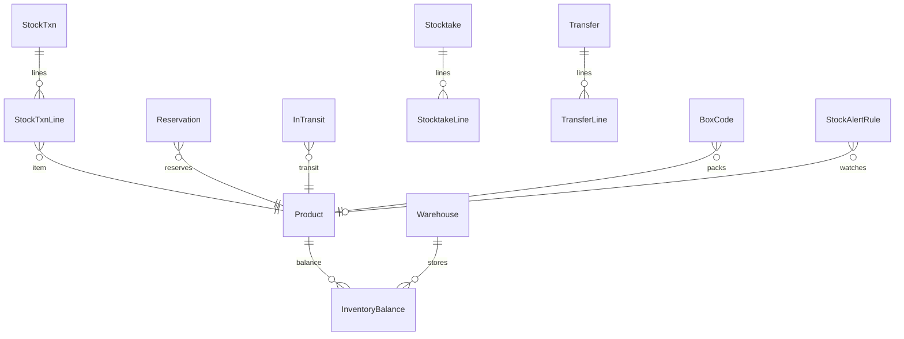

**功能映射**：库存查询、亏料/过量预警、入库质检、仓库/车间盘点与记录、销售退皮、物料调拨耗用、调价组装拆分、物料转应付、在途/待用/可用量、期初入库、出入库汇总、采购退货过账、箱码管理。

---

## 5. 生产管理

| 实体 | 中文名 | 主键 | 关键字段 | 关联 | 分期 |
|------|--------|------|----------|------|------|
| Process | 工序 | id | code, name, process_type(清洗/去皮/切断/去芯/切块/装袋/其他), is_piecework, is_handover_point, status | — | 一期 |
| ProcessPrice | 工序工价入口（生产侧） | id | process_id, product_spec_id, unit_id, price, effective_from, effective_to | Process, ProductSpec | 一期 |
| Routing | 工艺流程 | id | code, name, product_id, version, status | Product | 一期 |
| RoutingStep | 工艺步骤 | id | routing_id, seq_no, process_id, is_inbound_checkpoint, is_qc_required, workshop_id | Routing, Process, Workshop | 一期 |
| BOM | 物料清单头 | id | code, product_id, version, is_auto_generated, status | Product | 三期 |
| BOMLine | BOM 行 | id | bom_id, component_product_id, qty, unit_id, scrap_rate | BOM, Product | 三期 |
| ProductionTask | 生产任务单 | id | doc_no, source_type(sales/manual/merge), status, plan_start, plan_end, routing_id, workshop_id | Routing, Workshop | 一期 |
| ProductionTaskItem | 任务单商品行 | id | task_id, product_id, plan_qty, plan_weight, completed_qty | ProductionTask, Product | 一期 |
| TaskMerge | 多单整合 | id | merge_no, status | — | 一期 |
| TaskMergeLine | 整合来源 | id | merge_id, source_doc_type, source_doc_id, task_id | TaskMerge, ProductionTask | 一期 |
| WorkOrder | 工单 | id | doc_no, task_id, process_id, routing_step_id, status, plan_qty | ProductionTask, Process | 一期 |
| Dispatch | 派工/灵活派发 | id | doc_no, work_order_id, dispatch_type(normal/flex), worker_id, team_id, plan_qty, status, dispatched_at | WorkOrder, Employee, WorkTeam | 一期 |
| MaterialRequisition | 联动领料头 | id | doc_no, work_order_id, dispatch_id, warehouse_id, status | WorkOrder, Dispatch, Warehouse | 一期 |
| MaterialRequisitionLine | 领料行 | id | requisition_id, product_id, qty, base_qty, batch_no | MaterialRequisition, Product | 一期 |
| ReportWork | 扫码报工 | id | doc_no, dispatch_id, work_order_id, process_id, worker_id, report_type(output/handover), qty, weight, qty_net, deduct_impurity, deduct_water, qc_result, status, reported_at, scan_code | Dispatch, Process, Employee | 一期 |
| PieceworkSummary | 计件产量汇总 | id | worker_id, process_id, biz_date, qty, weight, amount, source_report_ids | Employee, Process | 一期 |
| ProgressSnapshot | 进度跟踪快照（可算可存） | id | task_id, routing_step_id, completed_qty, status | ProductionTask, RoutingStep | 一期 |
| QCOrder | 质检单（过程/成品） | id | doc_no, qc_type(process/finished/incoming_link), source_doc_type, source_doc_id, product_id, result, status | Product | 一期 |
| ReworkOrder | 返修单 | id | doc_no, source_qc_id, task_id, process_id, qty, status | QCOrder, ProductionTask | 一期 |
| ScrapRecord | 废料登记 | id | doc_no, task_id, process_id, product_id(废料料号), qty, weight, disposition, status | ProductionTask, Product | 一期 |
| DrawingLink | 图纸分发挂接 | id | drawing_id, task_id, work_order_id, process_id | Drawing, ProductionTask | 三期 |
| CostHidePolicy | 成本隐藏策略 | id | role_id, field_scope(json), is_enabled | Role | 三期 |
| OutsourceOrder | 委外加工单 | id | doc_no, supplier_id, process_id, product_id, qty, status | Supplier, Process, Product | 三期 |
| ConsignmentOrder | 受托加工单 | id | doc_no, customer_id, product_id, qty, status, progress | Customer, Product | 三期 |
| MRPRun | MRP 运算 | id | run_no, run_at, status, params_json | — | 三期 |
| MRPResult | MRP 结果 | id | run_id, product_id, demand_qty, supply_qty, shortage_qty, suggest_action | MRPRun, Product | 三期 |

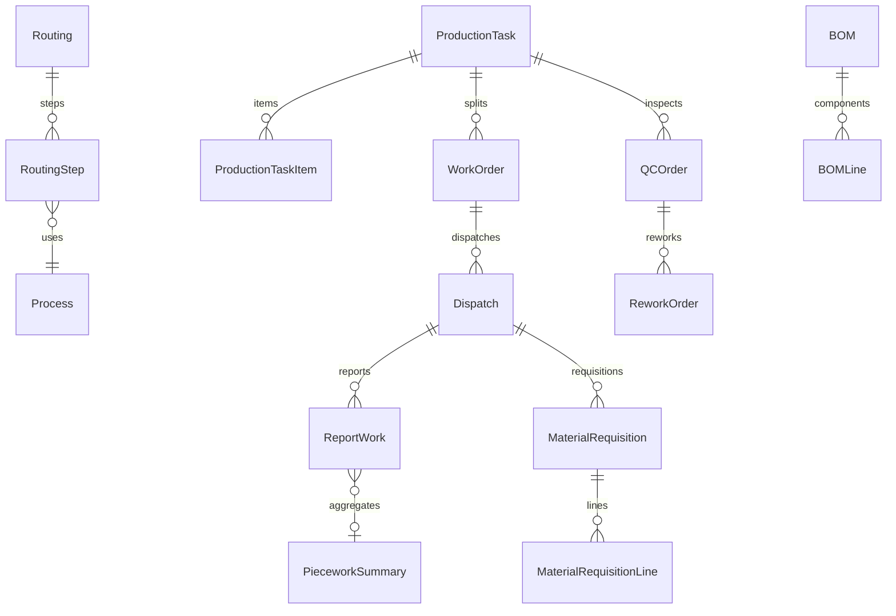

**功能映射**：多单整合、生产任务单、图纸分发、工序设置/管理、工艺流程、生产派工、灵活派发、扫码报工、计件工资、自动BOM、MRP、联动领料、车间工作台/管理、委外、受托、成本隐藏、一单多商品、进度跟踪、质检、返修、废料。

---

## 6. 工资管理

| 实体 | 中文名 | 主键 | 关键字段 | 关联 | 分期 |
|------|--------|------|----------|------|------|
| WorkerPayrollProfile | 工人工资档案 | id | employee_id, pay_type(piece/fixed/mixed), bank_account, tax_no, status | Employee | 一期 |
| ProcessWageRate | 工序工资（工价表） | id | process_id, product_id, product_spec_id, unit_id, rate, effective_from, effective_to | Process, Product, ProductSpec | 一期 |
| PayrollSheet | 工资单头 | id | doc_no, period_year, period_month, status, calc_at | — | 一期 |
| PayrollSheetLine | 工资单行 | id | sheet_id, employee_id, piece_amount, attendance_amount, commission_amount, adjust_amount, total_amount | PayrollSheet, Employee | 一期 |
| PayrollAdjust | 工资批量调整 | id | sheet_id, employee_id, adjust_type, amount, reason | PayrollSheet, Employee | 一期 |
| SalesCommissionRule | 销售提成规则 | id | name, rule_json, effective_from, effective_to, status | — | 一期 |
| CommissionCalc | 提成计算结果 | id | rule_id, employee_id, period, base_amount, commission_amount, source_doc_refs | SalesCommissionRule, Employee | 一期 |

**衔接**：`PieceworkSummary` + `ProcessWageRate` → 薪酬核算写入 `PayrollSheetLine`；系统管理「批量核算工资」触发批量生成 `PayrollSheet`。

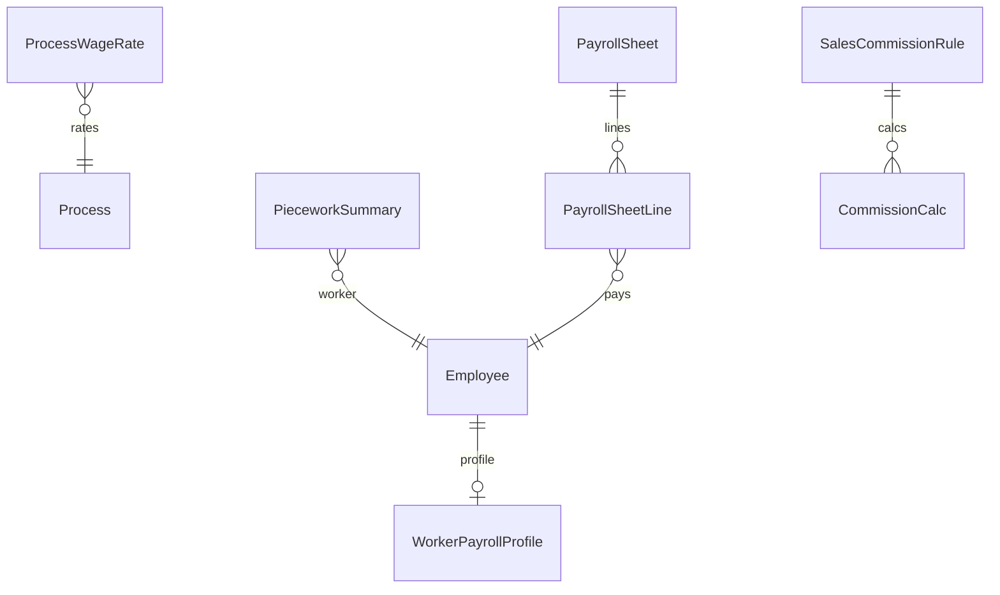

**功能映射**：工人信息管理、工资批量管理、工序工资、薪酬核算、销售提成。

---

## 7. 人事管理与权限

### 7.1 人事业务

| 实体 | 中文名 | 主键 | 关键字段 | 关联 | 分期 |
|------|--------|------|----------|------|------|
| Employee | 员工 | id | emp_no, name, org_id, dept_id, workshop_id, team_id, job_title, emp_type(piece/fixed/office), mobile, status, user_id | Organization, Department, Workshop, WorkTeam, User | 一期 |
| Onboard | 入职登记 | id | employee_id, onboard_date, status, role_ids_json | Employee | 一期 |
| Offboard | 离职登记 | id | employee_id, offboard_date, reason, revoke_permission(bool), status | Employee | 一期 |
| Shift | 班次 | id | code, name, start_time, end_time, workshop_id | Workshop | 一期 |
| AttendanceRule | 考勤规则 | id | name, shift_id, late_minutes, early_minutes, rule_json | Shift | 一期 |
| AttendanceRecord | 考勤打卡 | id | employee_id, biz_date, check_in_at, check_out_at, shift_id, source | Employee, Shift | 一期 |
| LeaveRequest | 请假单 | id | doc_no, employee_id, leave_type, start_at, end_at, status | Employee | 一期 |
| OvertimePatch | 加班/补卡 | id | doc_no, employee_id, biz_type(overtime/patch), biz_date, minutes, status | Employee | 一期 |
| AttendanceMonthStat | 考勤月度统计 | id | employee_id, year, month, work_days, late_times, ot_hours, leave_days | Employee | 一期 |
| PerformanceScheme | 绩效方案 | id | name, scheme_json, status | — | 一期 |
| PerformanceResult | 绩效结果 | id | scheme_id, employee_id, period, score, amount | PerformanceScheme, Employee | 一期 |
| AttendancePerfSummary | 考勤绩效汇总 | id | employee_id, period, attendance_score, perf_score, summary_json | Employee | 一期 |
| VisitRecord | 外访明细 | id | employee_id, customer_id, visit_at, content, location | Employee, Customer | 二期 |
| Memo | 备忘录 | id | owner_user_id, title, content, biz_date, scope(hr/system) | User | 一期 |
| EmployeeJournal | 员工日志 | id | employee_id, biz_date, content | Employee | 一期 |

### 7.2 权限分配 / 自定义权限

| 实体 | 中文名 | 主键 | 关键字段 | 关联 | 分期 |
|------|--------|------|----------|------|------|
| User | 登录用户 | id | login_name, password_hash, employee_id, user_type(admin/biz/line), status(active/frozen), last_login_at | Employee | 一期 |
| AdminGroup | 管理员分组 | id | code, name, remark, sort_no, status | — | 一期 |
| AdminGroupRole | 分组-角色 | id | group_id, role_id | AdminGroup, Role | 一期 |
| AdminGroupUser | 分组-用户 | id | group_id, user_id | AdminGroup, User | 一期 |
| Role | 角色 | id | code, name, data_scope_type(self/team/workshop/warehouse/all), status | — | 一期 |
| UserRole | 用户角色 | id | user_id, role_id | User, Role | 一期 |
| PermissionCode | 权限码 | id | code, name, domain, module, action | — | 一期 |
| RolePermission | 角色权限 | id | role_id, permission_id | Role, PermissionCode | 一期 |
| RoleWarehouseScope | 角色仓范围 | id | role_id, warehouse_id | Role, Warehouse | 一期 |
| RoleProcessScope | 角色工序范围 | id | role_id, process_id, can_report, can_dispatch | Role, Process | 一期 |
| FieldPolicy | 字段可见策略 | id | role_id, field_key, visible, editable | Role | 一期/三期（成本隐藏） |
| LoginPolicy | 登录控制 | id | max_fail_count, lock_minutes, session_ttl, password_rule_json | — | 一期 |

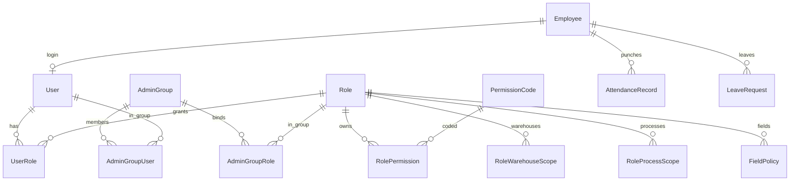

**功能映射**：权限分配（含管理员管理、管理员分组、角色管理、用户授权）、入职/离职、考勤/班次/绩效/请假、考勤明细与统计、外访、备忘、员工日志；自定义权限、登录控制、账户冻结、成本字段策略。

> **说明**：管理员分组、角色管理不新增第 3 章核心功能名，作为「权限分配」内能力展开；权限码格式仍为 `核心功能:功能模块:动作`。

---

## 8. 客户管理

| 实体 | 中文名 | 主键 | 关键字段 | 关联 | 分期 |
|------|--------|------|----------|------|------|
| Customer | 客户档案 | id | code, name, level, source, owner_user_id, protect_until, is_public_sea, is_hidden, status, contact_json, address | User | 二期 |
| Opportunity | 商机 | id | customer_id, stage, amount, expected_date, owner_user_id, status | Customer | 二期 |
| FollowUp | 客户跟进 | id | customer_id, opportunity_id, user_id, follow_at, content, next_remind_at | Customer, Opportunity, User | 二期 |
| LeadAssign | 资源/线索分配 | id | customer_id, from_user_id, to_user_id, assigned_at, lock_flag | Customer, User | 二期 |
| LeadProtectRule | 保护机制规则 | id | name, protect_days, release_rule_json, status | — | 二期 |
| LeadReleaseLog | 释放记录 | id | customer_id, released_at, reason, to_public_sea | Customer | 二期 |
| CrmTaskReminder | 任务提醒 | id | user_id, ref_type, ref_id, remind_at, content, status | User | 二期 |
| CustomerImportBatch | 导入批次 | id | file_name, imported_at, success_count, fail_count | — | 二期 |

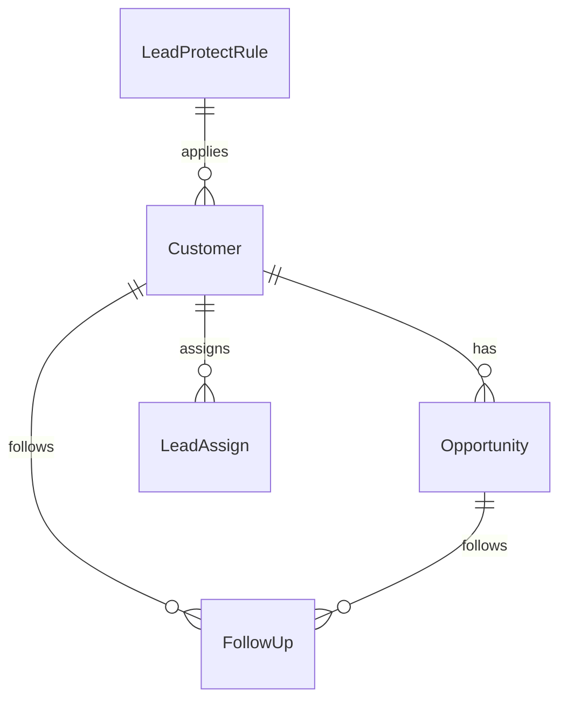

**功能映射**：CRM、商机、档案、跟进、资源分配、保护/释放、询价协同、导入、线索锁定/隐藏、任务提醒。

---

## 9. 销售管理

| 实体 | 中文名 | 主键 | 关键字段 | 关联 | 分期 |
|------|--------|------|----------|------|------|
| Inquiry | 询价单头 | id | doc_no, customer_id, owner_user_id, status, source(self/sales), expire_at | Customer, User | 二期 |
| InquiryLine | 询价行 | id | inquiry_id, product_id, qty, weight, quote_price, cost_ref, remark | Inquiry, Product | 二期 |
| QuoteHistory | 历史报价 | id | customer_id, product_id, price, quoted_at, inquiry_id, order_id | Customer, Product | 二期 |
| SalesOrder | 销售订单头 | id | doc_no, customer_id, owner_user_id, status, source(manual/self/rebuy), contract_id, price_lock_id, reorder_from_id, need_delivery_approval | Customer, Contract, PriceLock | 二期 |
| SalesOrderLine | 销售订单行 | id | order_id, product_id, qty, weight, price, amount, delivered_qty | SalesOrder, Product | 二期 |
| Contract | 合同 | id | doc_no, customer_id, amount, start_date, end_date, status, file_id | Customer | 二期 |
| PriceLock | 销售锁价 | id | customer_id, product_id, lock_price, effective_from, effective_to, status | Customer, Product | 二期 |
| PreShipment | 预发货 | id | doc_no, order_id, plan_ship_date, status, reserved | SalesOrder | 二期 |
| PreShipmentLine | 预发货行 | id | pre_shipment_id, order_line_id, product_id, qty | PreShipment, SalesOrderLine | 二期 |
| DeliveryApproval | 发货审批/发货单 | id | doc_no, order_id, pre_shipment_id, status, warehouse_id, shipped_at, logistics_no | SalesOrder, PreShipment, Warehouse | 二期 |
| DeliveryLine | 发货行 | id | delivery_id, product_id, qty, weight, batch_no, box_code_id | DeliveryApproval, Product | 二期 |
| SalesBOM | 订单级 BOM | id | order_id, product_id, version | SalesOrder, Product | 二期 |
| SalesBOMLine | 销售 BOM 行 | id | sales_bom_id, component_product_id, qty | SalesBOM, Product | 二期 |
| CostBudget | 订单成本预算 | id | order_id, material_cost, labor_cost, other_cost, total_cost, margin | SalesOrder | 二期 |
| QuoteCalculatorResult | 报价试算结果 | id | inquiry_id, order_id, input_json, result_json, created_by | Inquiry, SalesOrder | 二期 |
| SalesRankConfig | 排行榜配置 | id | name, metric, period_type, status | — | 二期 |
| OrderChangeLog | 修改订单记录 | id | order_id, change_json, changed_by, changed_at | SalesOrder | 二期 |

**预发货占用**：审批通过/生效时写 `Reservation`；发货过账写 `StockTxn` 并释放占用。

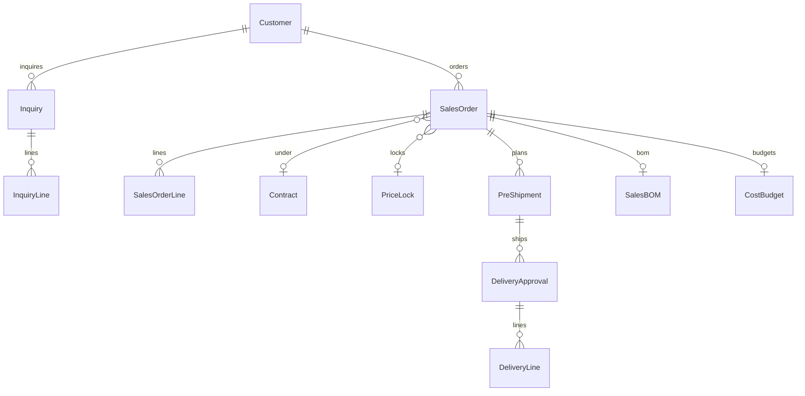

**功能映射**：销售订单、自助下单、询价、合同、改单、发货审批、预发货、打印（模板）、复购、排行榜、锁价、询价审批、历史报价、销售BOM、我的订单、成本预算、报价计算器。

---

## 10. 采购管理

| 实体 | 中文名 | 主键 | 关键字段 | 关联 | 分期 |
|------|--------|------|----------|------|------|
| Supplier | 供应商 | id | code, name, rating, contact_json, status | — | 二期 |
| PurchaseRequest | 采购申请头 | id | doc_no, applicant_id, status, need_date | Employee | 二期 |
| PurchaseRequestLine | 采购申请行 | id | request_id, product_id, qty, unit_id, suggest_supplier_id | PurchaseRequest, Product, Supplier | 二期 |
| PurchasePlan | 采购计划单头 | id | doc_no, status, plan_date | — | 二期 |
| PurchasePlanLine | 采购计划行 | id | plan_id, product_id, qty, supplier_id, request_line_id | PurchasePlan, Product, Supplier | 二期 |
| PurchaseInbound | 采购入库头 | id | doc_no, supplier_id, warehouse_id, status, biz_date, plan_id | Supplier, Warehouse, PurchasePlan | 二期 |
| PurchaseInboundLine | 采购入库行 | id | inbound_id, product_id, qty, price, amount, batch_no | PurchaseInbound, Product | 二期 |
| IncomingQC | 来料质检 | id | doc_no, inbound_id, product_id, qty_check, qty_pass, qty_fail, result, status | PurchaseInbound, Product | 二期 |
| PurchaseReturn | 采购退货 | id | doc_no, supplier_id, inbound_id, warehouse_id, status, reason | Supplier, PurchaseInbound | 二期 |
| PurchaseReturnLine | 退货行 | id | return_id, product_id, qty, amount | PurchaseReturn, Product | 二期 |
| SupplierPriceHistory | 历史采购价 | id | supplier_id, product_id, price, biz_date, source_doc_id | Supplier, Product | 二期 |
| PurchaseTask | 采购任务 | id | doc_no, assignee_id, product_id, qty, status, due_date | Employee, Product | 二期 |

**过账**：来料质检合格 → `StockTxn(doc_type=purchase_in)`；不合格/退货 → `PurchaseReturn` → `StockTxn(doc_type=purchase_return)`。

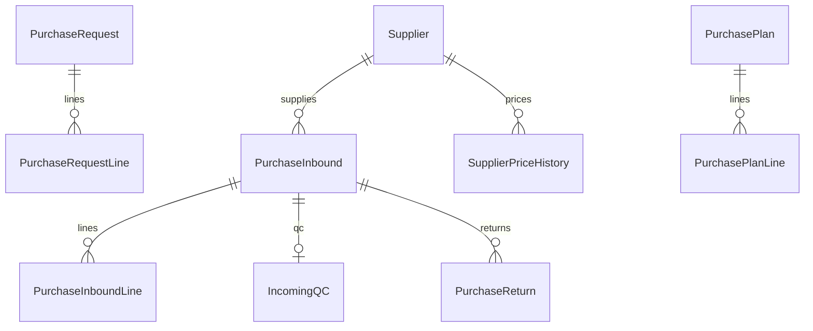

**功能映射**：供应商、采购申请、计划单、入库、来料质检、退货、分析（报表侧）、历史价格、采购任务。

---

## 11. 财务管理

| 实体 | 中文名 | 主键 | 关键字段 | 关联 | 分期 |
|------|--------|------|----------|------|------|
| AccountSubject | 会计科目/账目 | id | code, name, parent_id, subject_type, status | — | 三期 |
| FundAccount | 资金账户 | id | code, name, currency, balance, status | — | 三期 |
| FundTransfer | 资金调拨 | id | doc_no, from_account_id, to_account_id, amount, status | FundAccount | 三期 |
| LedgerEntry | 交易流水账 | id | doc_no, account_id, direction, amount, biz_date, counterparty, source_doc_type, source_doc_id | FundAccount / AccountSubject | 三期 |
| IncomeExpenseDetail | 收入支出明细 | id | entry_id, category, amount, remark | LedgerEntry | 三期 |
| Voucher | 凭证头 | id | doc_no, period, biz_date, status, summary | — | 三期 |
| VoucherLine | 凭证行 | id | voucher_id, subject_id, debit, credit, remark | Voucher, AccountSubject | 三期 |
| Invoice | 发票 | id | invoice_no, direction(in/out), counterparty_id, amount, tax, status, biz_date | — | 三期 |
| ReceiptWriteOff | 收款核单 | id | doc_no, customer_id, amount, status, received_at | Customer | 三期 |
| ReceiptWriteOffLine | 核销行 | id | writeoff_id, sales_order_id, amount | ReceiptWriteOff, SalesOrder | 三期 |
| PaymentRecognition | 销售认款 | id | doc_no, customer_id, amount, fund_account_id, status | Customer, FundAccount | 三期 |
| PrepayPrepaid | 预收预付 | id | doc_no, party_type(customer/supplier), party_id, direction, amount, balance, status | — | 三期 |
| FxSettlement | 外币结汇 | id | doc_no, currency, amount_fx, rate, amount_local, status | — | 三期 |
| CostAllocation | 费用分摊 | id | doc_no, source_amount, alloc_json, status, revoked_from_id | — | 三期 |
| ReceiptAlert | 收款预警 | id | customer_id, order_id, due_date, overdue_days, status | Customer, SalesOrder | 三期 |
| CashierReconcile | 出纳对账 | id | doc_no, fund_account_id, biz_date, book_balance, actual_balance, status | FundAccount | 三期 |
| CostAccounting | 成本核算单 | id | doc_no, period, task_id, product_id, material_cost, labor_cost, overhead, total_cost, status | ProductionTask, Product | 三期 |
| CostTraceLine | 成本明细溯源 | id | cost_id, source_type(report/requisition/stock), source_id, amount | CostAccounting | 三期 |
| ContractProfit | 合同利润 | id | contract_id, revenue, cost, profit, period | Contract | 三期 |
| SalesReturnFinance | 销售退货退单财务 | id | doc_no, order_id, amount, status | SalesOrder | 三期 |
| ARAPAdjust | 往来调整单 | id | doc_no, party_type, party_id, amount, direction, status | — | 三期 |
| MonthClose | 月度结转 | id | year, month, status, closed_at, closed_by | — | 三期 |
| MiniProgramBill | 小程序账单/支付对账 | id | bill_no, channel, amount, status, order_id, paid_at | SalesOrder | 三期 |

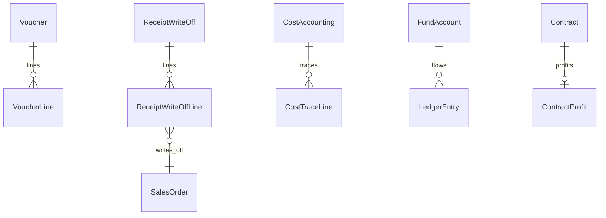

**功能映射**：账目、流水、收支、订单财务视角、小程序、凭证、发票、收款核单、结汇、分摊撤销、收款预警、出纳对账、预收预付、成本核算、合同利润、认款、退货退单、往来调整、财务审批入口、资金、报表、成本溯源、月结。

---

## 12. 固定资产管理

| 实体 | 中文名 | 主键 | 关键字段 | 关联 | 分期 |
|------|--------|------|----------|------|------|
| FixedAssetCategory | 固定资产类别 | id | code, name, parent_id | — | 三期 |
| FixedAsset | 固定资产项目/卡片 | id | code, name, category_id, dept_id, location_text, original_value, net_value, status, purchase_date | FixedAssetCategory, Department | 三期 |
| AssetTransfer | 内部转移 | id | doc_no, asset_id, from_dept_id, to_dept_id, from_location, to_location, status, transferred_at | FixedAsset, Department | 三期 |

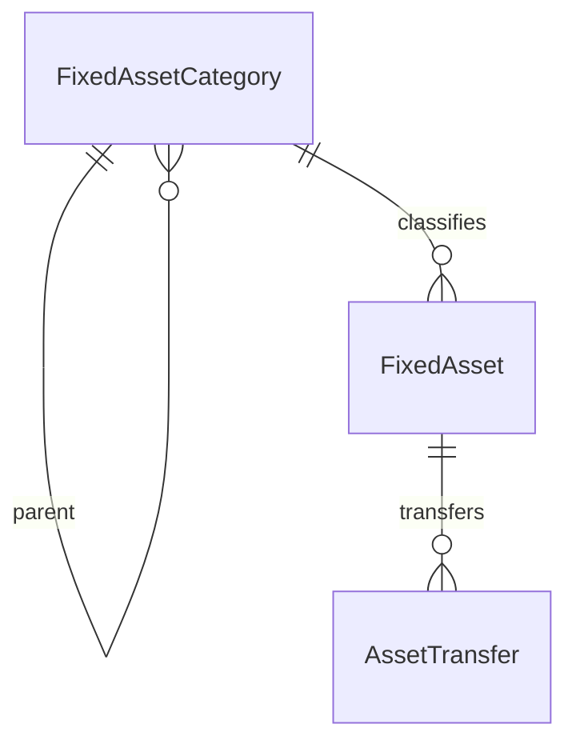

**功能映射**：类别、项目、内部转移、统计（报表侧聚合）。

---

## 13. 审批管理

| 实体 | 中文名 | 主键 | 关键字段 | 关联 | 分期 |
|------|--------|------|----------|------|------|
| ApprovalFlow | 审批流程定义 | id | code, name, doc_type, is_enabled, version | — | 二期（一期可用简化单据审核） |
| ApprovalNode | 审批节点 | id | flow_id, seq_no, node_name, approver_type(role/user), approver_ref, can_reject | ApprovalFlow | 二期 |
| ApprovalTask | 审批任务 | id | flow_id, node_id, doc_type, doc_id, assignee_user_id, status(pending/approved/rejected), acted_at, comment | ApprovalFlow, ApprovalNode, User | 一期 |
| ExpenseRequest | 费用申请 | id | doc_no, applicant_id, amount, category, status, remark | Employee | 二期 |
| AffairRequest | 事务申请 | id | doc_no, applicant_id, content, status | Employee | 二期 |

**一期**：考勤类（`LeaveRequest` / `OvertimePatch`）与通用 `ApprovalTask` 对接即可。  
**二期**：采购申请/计划、询价及询价明细/财务节点挂同一套 Flow+Task。

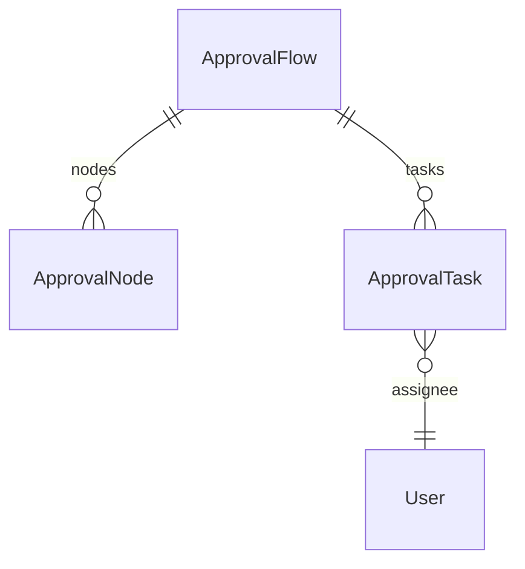

**功能映射**：任务管理、单据审核、费用/询价/采购/计划/事务/考勤审批、费用申请。

---

## 14. 系统管理

| 实体 | 中文名 | 主键 | 关键字段 | 关联 | 分期 |
|------|--------|------|----------|------|------|
| OrgSetting | 基础参数 | id | key, value_json, org_id | Organization | 一期 |
| ProductionSetting | 生产设置 | id | key, value_json（报工校验、领料联动、收货卡点等） | — | 一期 |
| SalesSetting | 销售设置 | id | key, value_json | — | 二期 |
| PrintTemplate | 自定义打印模板 | id | code, name, doc_type, template_body, status | — | 二期 |
| MenuCustom | 自定义菜单 | id | role_id, menu_key, visible, sort_no | Role | 一期 |
| TableCustom | 表格自定义 | id | user_id, page_key, columns_json | User | 一期 |
| Formula | 公式设置 | id | code, name, expression, biz_domain | — | 二期 |
| LogisticsCarrier | 物流承运商 | id | code, name, api_config_json, status | — | 二期 |
| LogisticsTrack | 物流轨迹 | id | carrier_id, tracking_no, status, last_event_json, ref_doc_type, ref_doc_id | LogisticsCarrier | 二期 |
| DocLockRule | 单据锁定规则 | id | doc_type, lock_when_status, allow_roles_json | — | 一期 |
| DocEditRule | 单据编辑策略 | id | doc_type, editable_statuses, field_rules_json | — | 一期 |
| DocDeleteRule | 单据删除策略 | id | doc_type, allow_status, need_approval | — | 一期 |
| DocApproveSwitch | 单据是否需审 | id | doc_type, need_approval, flow_id | ApprovalFlow | 一期 |
| NotifyRule | 单据/事项通知规则 | id | event_key, channel, template, receivers_json | — | 一期 |
| Reminder | 事项提醒 | id | user_id, title, content, remind_at, status, ref_type, ref_id | User | 一期 |
| Announcement | 公告 | id | title, content, publish_at, status, audience_json | — | 一期 |
| Knowledge | 知识库条目 | id | title, content, category, status | — | 三期 |
| Course | 学堂内容 | id | title, content, category, status | — | 三期 |
| Drawing | 图纸库 | id | code, name, file_url, version, product_id | Product | 三期 |
| DocumentFile | 文档库 | id | name, file_url, category, status | — | 三期 |
| OperationLog | 操作日志 | id | user_id, action, module, ref_type, ref_id, detail_json, ip, created_at | User | 一期 |
| SearchConfig | 多条件检索配置 | id | page_key, fields_json | — | 二期 |
| FinanceAuditControl | 财审管控开关 | id | key, enabled, rule_json | — | 三期 |
| BatchPriceJob | 批量改价任务 | id | status, filter_json, new_price_rule, executed_at | — | 二期 |
| BatchPayrollJob | 批量核算工资任务 | id | period_year, period_month, status, executed_at | — | 一期 |
| PersonnelTransfer | 人事调动 | id | employee_id, from_dept_id, to_dept_id, from_post, to_post, effective_date, status | Employee | 一期 |

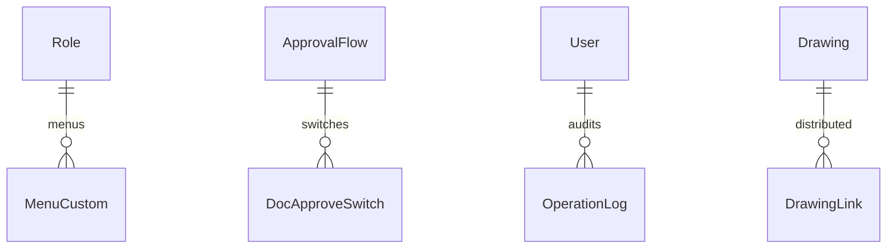

**功能映射**：基础设置、打印、菜单、权限（见第 7 章）、表格、公式、销售/生产设置、物流、审批流程设定、人事调动、登录控制、批量改价/核算工资、单据审批/锁定/通知/编辑/删除、事项提醒、检索、账户冻结、财审管控、学堂/知识库/图纸/文档、员工日志策略、操作日志、公告、备忘录。

---

## 15. 统计报表（配置层）

> 报表**不以独立业务事实表为主**；产量、出入库、毛利等来自各域流水聚合。本域落「定义与看板配置」。

| 实体 | 中文名 | 主键 | 关键字段 | 关联 | 分期 |
|------|--------|------|----------|------|------|
| ReportDefinition | 报表定义 | id | code, name, report_type, query_config_json, status | — | 二期 |
| DashboardWidget | 驾驶舱/看板组件 | id | dashboard_key(boss/production/live), title, metric_key, layout_json, refresh_sec | — | 三期（生产看板可二期） |
| ReportSnapshot | 日报等快照（可选） | id | report_code, biz_date, payload_json | — | 二期 |

**功能映射对照（数据来源）**：

| 功能模块 | 主要事实来源 |
|----------|--------------|
| 出入库查询 / 收发存明细 | StockTxn / InventoryBalance |
| 生产看板 / 生产实况 / 进度 | ProductionTask, ReportWork, ProgressSnapshot |
| 质检报表 | QCOrder, IncomingQC, InboundQC |
| 销售重量 / 产品销售 | SalesOrderLine, DeliveryLine |
| CRM / 跟进 / 询价查询 | Customer, FollowUp, Inquiry |
| 毛利润 / 成本利润 / 三表 | Finance 域凭证与成本核算 + 销售 |
| 老板驾驶舱 | DashboardWidget + 多域聚合 |
| 系统物流查询 | LogisticsTrack |

---

## 16. 跨域主链路

### 16.1 生产计件闭环

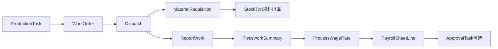

| 步骤 | 实体 | 说明 |
|------|------|------|
| 任务下达 | ProductionTask / Item | 可多 SKU；可经 TaskMerge |
| 派工 | WorkOrder → Dispatch | normal / flex |
| 领料 | MaterialRequisition → StockTxn | 联动派工/报工 |
| 报工 | ReportWork | 含交接确认、扣杂扣水 |
| 计件 | PieceworkSummary | 产量汇总 |
| 算薪 | ProcessWageRate → PayrollSheet | 可经 BatchPayrollJob |

### 16.2 采购入库闭环

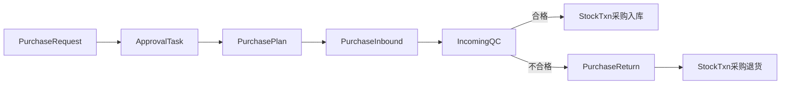

### 16.3 销售出库闭环

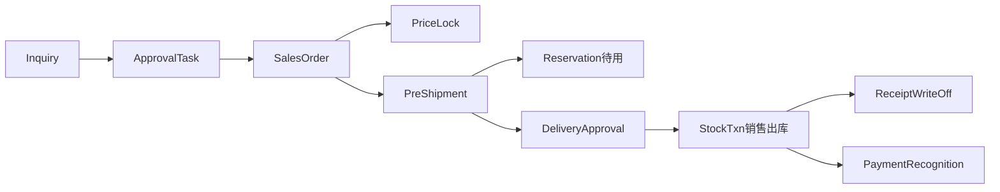

### 16.4 权限闭环

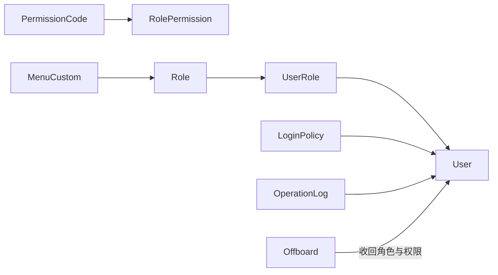

### 16.5 跨域外键一览（高频）

| 从 | 到 | 用途 |
|----|----|------|
| StockTxnLine.product_id | Product | 所有入出库 |
| MaterialRequisition → StockTxn | 过账关联 source_doc | 领料耗用 |
| PurchaseInbound → StockTxn | source_doc | 采购入库 |
| DeliveryApproval → StockTxn | source_doc | 销售出库 |
| SalesOrder / PreShipment → Reservation | source_doc | 待用占用 |
| ReportWork.worker_id | Employee | 计件归属 |
| PayrollSheetLine ← PieceworkSummary | 汇总引用 | 薪酬 |
| ApprovalTask.doc_id | 各业务单据 | 多态关联 |
| User.employee_id | Employee | 人账一体 |
| RoleWarehouseScope / RoleProcessScope | Warehouse / Process | 数据范围 |
| CostTraceLine | ReportWork / MaterialRequisition / StockTxn | 成本溯源 |
| DrawingLink.drawing_id | Drawing | 图纸分发 |

---

## 17. 功能覆盖核对

对照框架设计文档第 3 章核心功能表与第 9 章闭环，逻辑实体覆盖结论如下。

### 17.1 按域覆盖

| 核心功能 | 覆盖方式 | 结果 |
|----------|----------|------|
| 销售管理 | Inquiry~QuoteCalculator、OrderChangeLog、SalesRankConfig、打印走 PrintTemplate | 已覆盖 |
| 客户管理 | Customer 全链路 + CrmTaskReminder + ImportBatch | 已覆盖 |
| 采购管理 | Supplier~PurchaseTask + 历史价 | 已覆盖 |
| 生产管理 | Process~MRP、委外受托、CostHidePolicy、废料返修质检 | 已覆盖 |
| 库存管理 | Balance/Txn/Reservation/InTransit/盘点/箱码/预警/退皮/转应付 | 已覆盖 |
| 产品管理 | Product 五实体 | 已覆盖 |
| 固定资产 | Category/Asset/Transfer | 已覆盖 |
| 财务管理 | 科目资金凭证发票核销成本月结等 | 已覆盖 |
| 工资管理 | 档案/工价/工资单/提成 | 已覆盖 |
| 人事管理 | 员工考勤绩效 + User/Role/Permission | 已覆盖 |
| 统计报表 | ReportDefinition/DashboardWidget + 事实溯源表 | 已覆盖（配置+溯源） |
| 审批管理 | Flow/Node/Task + 费用/事务申请 | 已覆盖 |
| 系统管理 | 设置/模板/菜单/日志/图纸文档等 | 已覆盖 |

### 17.2 闭环核对

| 闭环 | 实体链完整 | 备注 |
|------|------------|------|
| 生产计件 | 是 | 收货卡点=ReportWork/QC，不混采购收货 |
| 采购入库 | 是 | 质检分流退货过账 |
| 销售出库 | 是 | 预发货写 Reservation，发货写 StockTxn |
| 权限 | 是 | 离职 Offboard 收回 UserRole |

### 17.3 设计取舍（供物理设计参考）

1. **Consume / Transfer** 可在物理层并入 `StockTxn.doc_type`，逻辑上保留便于权限与菜单映射。  
2. **ProcessPrice** 与 **ProcessWageRate** 可合并为一张工价表，逻辑分域是为对接「生产·工序管理」与「工资·工序工资」。  
3. **ApprovalTask.doc_id** 为多态，物理层建议 `(doc_type, doc_id)` 联合 + 必要索引。  
4. **报表** 不建平行业务库；财务三表由凭证与结转生成，驾驶舱为配置+查询。  
5. **一仓多形态半成品**：用 `Product` 分料号 + `Warehouse.warehouse_type` / `Location` 区分，不另建流程域名。

---

## 18. 分期建表建议（摘要）

| 分期 | 优先实体组 |
|------|------------|
| **一期** | 公共主数据；Product*；Warehouse/InventoryBalance/StockTxn*/Reservation/InTransit/Stocktake*/BoxCode/StockAlertRule；Process/Routing*/ProductionTask*/WorkOrder/Dispatch/MaterialRequisition*/ReportWork/PieceworkSummary/QCOrder/ReworkOrder/ScrapRecord；工资全套；Employee/考勤/User/Role/Permission*；ApprovalTask；系统基础设置/菜单权限/登录/操作日志/BatchPayrollJob |
| **二期** | Customer*；销售全套；采购全套；ApprovalFlow/Node；SalesSetting/PrintTemplate/Logistics*；ReportDefinition；生产看板类 DashboardWidget |
| **三期** | Finance 全套；FixedAsset*；BOM/MRP/Outsource/Consignment/CostHide/CostTrace；Drawing/Knowledge/Course/Document；老板驾驶舱与财务三表配置 |

---

## 19. 文档结论

1. 本模型严格映射 13 大域功能模块，**不新增业务域名**。  
2. 库存以 `StockTxn` 为唯一过账事实源；可用量 = 结存 − 待用 ± 在途。  
3. 产线「收货」归生产报工/质检；采购收货归采购入库+来料质检。  
4. 计件链路：领料 → 报工 → 工价 → 工资单，可审批。  
5. 下一步物理库设计：按本章实体落表、定类型与索引，并按第 18 章分期实施。
